* Table of Contents
{:toc}

--------------------------------------------------------------------------------------------------------------------
## **Design**

### Storage Component

<p id="storage-class-diagram" align="center">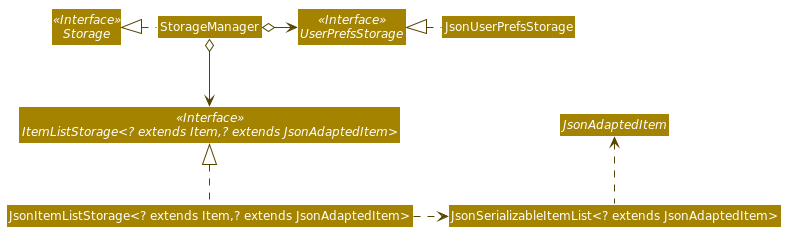</p>

API : [Storage.java]
(https://github.com/AY2021S1-CS2103T-T15-4/tp/blob/master/src/main/java/seedu/address/storage/Storage.java)

The Storage component,
* can save UserPref objects in json format and read it back.
* can save the InternHunter data in json format and read it back.

        
## **Implementation**

This section describes some noteworthy details on how certain features are implemented.

### Implementation of `Command` classes

#### Current Implementation
There are 4 different subclasses of `Item` in InternHunter, namely `Company`, `Internship`, `Application`, and
`Profile`. <br/>

There are 2 types of commands:
- Commands that are dependent on the type of `Item`
    - e.g. `AddCommand`, `DeleteCommand`, `EditCommand`
    - These commands are implemented as _abstract_ classes that inherit from the `Command` class. Type specific
    commands like `AddCompanyCommand` and `AddApplicationCommand` inherit from the _abstract_ `AddCommand`
    class
- Commands that are not dependent on the type of `Item`
    - e.g. `SwitchCommand`, `HelpCommand`, `ExitCommand`
    - These commands are implemented as _concrete_ classes and inherit directly from the `Command` class

From this point on, we will be using `XCommand` to represent commands that are dependent on type and
`YCommand` to represent commands that are independent of type.

The following is an example of the class hierachy:

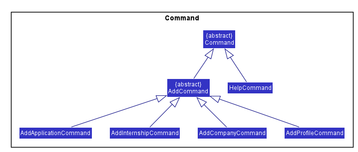

#### Design considerations

##### Aspect: Whether `XCommand` should be abstract and split into 4 other `XItemCommand` or handle the 4 `Item` types on its own

**Alternative 1 (current choice)**: `XCommand` is split into 4 other `XItemCommand`. Parser parses the
user input and creates the specific `XItemCommand` for execution. The following activity diagram shows how the 
execution of the `AddApplicationCommand` will work.

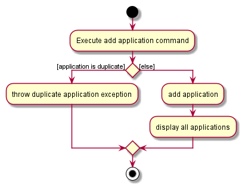

- Pros: 
    - Each command has its own specific task to execute. This means that classes are more flexible and can be changed
    very easily. 
    - Higher cohesion as the class is only dependent on the one `Item` type
    - Short and concise `execute` method, providing better readability and maintainability
- Cons:
    - More classes have to be created
        
- **Alternative 2**: `XCommand` is a _concrete_ class and handles the execution of all 4 `Item` types.
Parser parses the user input and creates the general `XCommand` for execution. The following
activity diagram shows how the `AddCommand` will work.

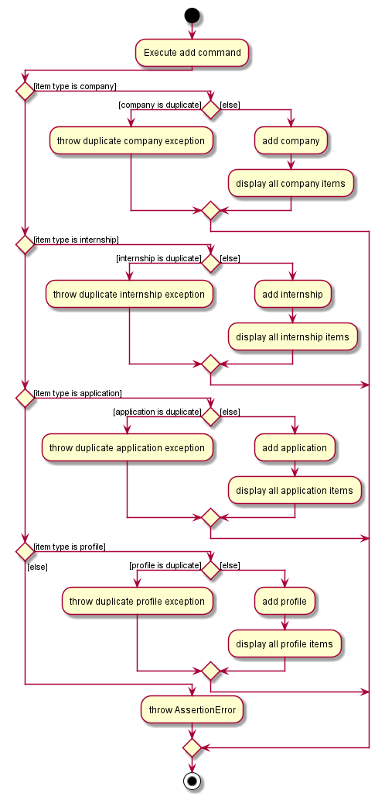

- Pros:
    - Only one command is needed, reducing the number of classes created
- Cons:
    - `execute` method becomes extremely long as it needs to contain switch statements to handle the execution of
    command X for the 4 different types of `Item`
    - `XCommand` class is vulnerable to drastic changes when the parsing method of any one `Item` class changes
    - `XCommand` class holds more dependencies as it is now dependent on the 4 `Item` classes  
    - Poor readability and maintainability
    - A slight overhead increase as `Item` type needs to be passed in as a parameter to the `XCommand`,
    additional check for nullity in the parameter passed in is required

**Conclusion**: Our group settled on the first design, since it better adheres to OOP principles such as
Single Responsiblity Principle. Our design meant that each specific `Item` command is only dependent on the `Item`
itself and not subjected to the changes in implementation of the other `Item` classes. This means that it will only
have one reason to change. Moreover, this leads to lower coupling, which makes maintenance, integration and
testing easier. This ended up being a good choice as we had some changes in the parsing requirements of one
of the `Item` classes, `Internship`. If we had gone with the second design, the concrete `XCommand` might
have broken down as it might not be suited to the different parsing requirements in the of the `Internship` item.

### Delete company feature

#### What it is
Users are able to execute a command to delete a company from their list of companies in InterHunter. Upon the 
successful deletion of a company, all internships within that company, if any, will also be deleted (as they are a 
part of the company, i.e. companies and the internships that they offer have a whole-part / composition relationship). 
As a result, all applications made to internships from the company to be deleted, if any, will also be deleted as per 
the delete internship feature. This feature is intended to be used when the user is viewing the Company tab. However, 
the user is free to execute the delete company command while they are on another tab, and InternHunter will simply 
switch over to the Company tab if and when the command has finished executing successfully.

**Command format**: `delete com INDEX`
* Where `INDEX` is the index of the company to be deleted in the list of companies

#### Implementation
Upon a user’s entry of a valid delete company command, a `DeleteCompanyCommand` object is created. 
`DeleteCompanyCommand` is a class that extends the `DeleteCommandAbstract` abstract class that in turn extends the 
`Command` abstract class.


`DeleteCompanyCommand` implements the `execute()` method from the `Command` abstract class whereby upon execution, the 
method will delete the respective company in the model’s list of companies if a valid index is given.

This is how the `DeleteCompanyCommand#execute()` method works upon execution:

1. The tab that the user is currently viewing is obtained via the `Model#getTabName()` method.
2. The company to be deleted is retrieved from the model’s `companyList` via the `CommandUtil#getCompany()` method.
3. All the internships within the company, if any, are deleted via a self-invocation to `DeleteCompanyCommand`’s own 
 `deleteAllInternshipsInCompany()` method.
4. The company is then deleted from the model via the `model#deleteCompany()` method.
5. The deletion is successful and a `CommandResult` is returned with an appropriate success message to indicate 
 operation success via the `CommandUtil#getCommandResult()` method. The `CommandResult` also indicates whether the tab 
 needs to be switched to the Company tab or not, based on if the user was already viewing the Company tab or not as 
 retrieved in Step 1.

The following sequence diagrams show how the delete company feature works successfully, using the example command 
`delete com 3`:

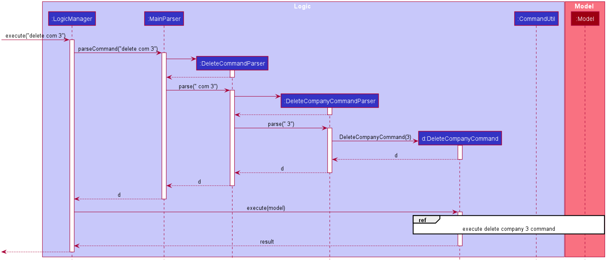

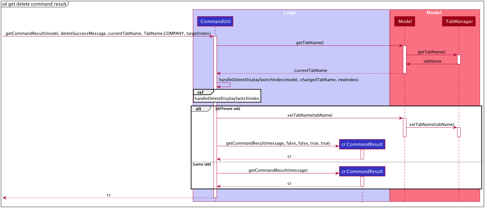
HandleDeleteDisplaySwitchIndexSequenceDiagram can be found [here](#handle-delete-display-switch-index-sequence-diagram)

#### Design considerations
* Obtaining the tab that the user is currently viewing has to be done before deleting all the company’s internships 
via the `DeleteCompanyCommand#deleteAllInternshipsInCompany()` method. This is because the 
`DeleteCompanyCommand#deleteAllInternshipsInCompany()` method executes `DeleteInternshipCommands`, and 
`DeleteInternshipCommands` will cause the model to switch tabs to the Company tab internally (i.e. updates are made to 
the relevant objects’ fields but this change is not reflected via the GUI). The implication of this behaviour is that 
if the model’s tab is obtained after the `DeleteCompanyCommand#deleteAllInternshipsInCompany()` method is executed, 
then it will always reflect that the model is on the Company tab and hence no switching of tabs is necessary GUI-wise. 
In other words, if the user successfully executes the delete company command whilst not on the Company tab, the tab 
will not be switched to the Company tab in the GUI, which is undesirable. Our implementation resolves this issue.
* The `DeleteCompanyCommand#deleteAllInternshipsInCompany()` method works by creating and executing a 
`DeleteInternshipCommand` for every internship in the company’s list of internships. This implementation was chosen 
because `DeleteInternshipCommand` handles deleting any application made to the internship that is being deleted. As 
such, the delete company command will exhibit the behaviour whereby any applications made to internships offered by a 
company that is being deleted will also be deleted, which is the behaviour we believe is appropriate and hence wanted 
to achieve.

#### Alternatives considered
* **Alternative 1 (current choice)**: Delete all applications made to internships from the company to be deleted by
 executing delete internship commands.
  * Pros:
    * Avoids rewriting code / code duplication by calling methods that have already been implemented to achieve the 
    desired functionality.
    * Ensures consistent behaviour - when an internship is deleted because a company is deleted, what happens to any 
    application for that internship will be the same as what would happen to it if a delete internship command was 
    executed directly by the user for the same internship.
  * Cons:
    * Introduces a dependency on `DeleteInternshipCommand`.

* **Alternative 2**: Delete all applications made to internships from the company to be deleted without executing
delete internship commands, i.e. by implementing delete internship command’s internal workings.
  * Pros:
    * Not dependent on `DeleteInternshipCommand`.
  * Cons:
    * Introduces dependencies on `InternshipItem` and `ApplicationItem`.
    * Violates the DRY (Don't Repeat Yourself) principle:
      * Introduces code duplication.
      * Decentralizes the behaviour of what happens to an application made for an internship that is being deleted, 
      since there are now 2 separate implementations for this (one in `DeleteCompanyCommand` and the other in 
      `DeleteInternshipCommand`). The implications of this are:
        * Cannot guarantee consistent behaviour - when an internship is deleted because a company is deleted, what 
        happens to any application for that internship may not be the same as what would happen to it if a delete 
        internship command was executed directly by the user for the same internship.
        * Updating this behaviour will require updating code in both places rather than one centralised place.

### User profile feature

The user profile feature behaves like a resume for the user to keep track of noteworthy events and milestones in one
's professional life. There are three categories of profile items namely: `ACHIEVEMENT`, `SKILL` and `EXPERIENCE`. 

#### Editing User profile

The `edit me` command for the user profile allows the user to update the fields of the each profile item by
specifying the targeted index and at least one field. The following activity diagram illustrates the possible
behaviour of the `edit me` command depending on the user input:

to Add: activity diagram

#### Implementation

* The functionality edit profile is implemented as part of the `EditProfileCommand` which extends the the abstract class
 `EditCommand` which further extends the `Command` class.
* The `EditProfileCommand` is produced by its own `EditProfileCommandParser#parse` method.

This is an example of what the edit feature does at every step to achieve its intended behaviour:

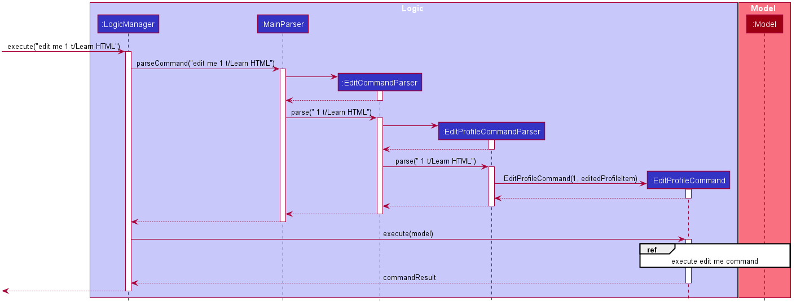


1. Assuming user enters an input complying with the specification of the user guide to edit the user profile, the
 input is first parsed by the `MainParser` looks out for the command word, recognizes the `edit` command and
  funnels the input to `EditCommandParser`.
2. The `EditCommandParser` then identifies the item type, which is profile item and returns the
 `EditProfileCommandParser`.
3. The `EditProfileCommandParser` creates a editedProfileItem based on the details of the input provided and returns a
 `EditProfileCommand` containing with the editedProfileItem. The following sequence diagram depicts how the `EditProfileCommand` works:

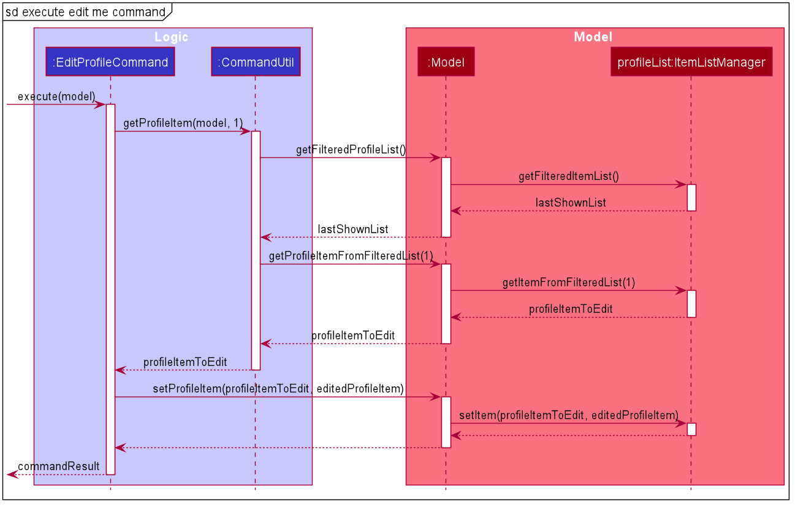

4. The `EditProfileCommand` is executed by `LogicManager` which retrieves the targeted `profileItemToEdit` from the `lastShownList` and updates
 the model with the `editedProfileItem` associated with the `EditProfileCommand`.
5. CommandResult is return to indicate a successful operation.
 
#### Design considerations

#### Aspect: How EditProfileCommand Object interacts with Model
#### Alternatives considered
* **Alternative 1 (current choice)**: `EditProfileCommand` interact with the model solely and not directly with model's 
 internal components: `ProfileItemList` and `FilteredProfileItemList`.
  * Pros:
    * This obeys the Law of Demeter which stresses for components to avoid interacting directly with internal
     components of other objects. This reduces coupling which increases testability as `EditProfileCommand` only
     requires one model
      stub as opposed to more objects stubs for testing.
    * This also increases maintainability as `EditProfileCommand` only has to be concerned with the methods that
     `Model` provides and not the other implementation details should they be subjected to change.
  * Cons:
    * This increases code volume within `Model` as the model need to hold every method to interact with all the
   collections it contains.

* **Alternative 2 (used in v1.2)**: Due to the presence of other collections such as `companyList` in the model, the
 `filteredProfileLists` and `profileList` are both retrieved from the model within the `EditProfileCommand` and then the
  `setItemList()` operation is called directly on the `profileList` to update its value.
  
  ```
  model.getProfileList().setItem(profileItemToEdit, EditedProfileItem)
  ```
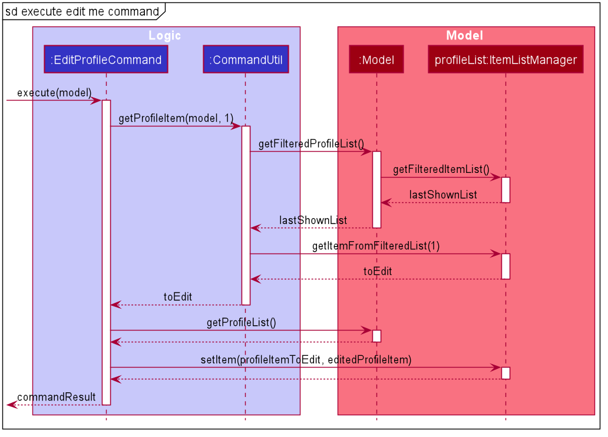

  * Pros: 
    * This reduces code volume by keeping `Model` lean and for `EditProfileObject`to interact with the objects it needs.
    * This may marginally improve performance as it bypasses the `Model` to interact with the `profileList` and
     `filteredProfileList` directly.
  * Cons:
    * This exposes the internal components of the `Model` which increases coupling as `EditProfileCommand` is now
     dependent on `filteredProfileList` and `profileList` of the `ItemListManager` reduces testability and
      maintainability.
    

### Switch screen feature

#### What it is
Users are able to execute a command to switch their tabs in InterHunter. There are 3 tabs, Company, Application, Profile. Take for example swithcing to the company tab, upon the successful switch of the tabs, the screen will now display a list of companies and also display the information of the last known index of that tab, i.e if the index that was previously saved in that tab was the 3rd index, when switching back to this tab, it will show the information of the 3rd index.

**Command format**: `switch TYPE`
`TYPE` is the type of tab.
There are three `TYPE`s:
* `com`
* `app`
* `me`

#### Implementation
Upon a user’s entry of a valid switch command, a `SwitchCommand` object is created. `SwitchCommand` is a class that extends the Command abstract class as well as having direct association with TabName, an enumeration, as well as having a dependency to the Model interface as it relies on some of its method.

<p align="left">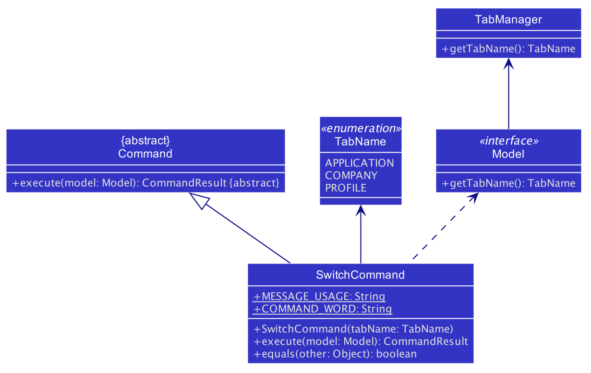</p>

`SwitchCommand` implements the `execute()` method from the `Command` abstract class whereby upon execution, the 
method will switch the tab and the screen if a valid command is provided.

This is how the `SwitchCommand#execute()` method works upon execution:
1. The current tab that the user is viewing is obtained via the `Model#getTabName()` method.
2. The input tab will be check against the current tab. <br/>
 2a. If both the tabs are the same, a same tab message will be passed to `CommandUtil#getCommandResult()`method. <br/>
 2b. If both the tabs are different, a success message will be passed to `CommandUtil#getCommandResult()`method. <br/>

<p align="center">The overall process of how <code>SwitchCommand</code> was generated.</p>

<p align="center">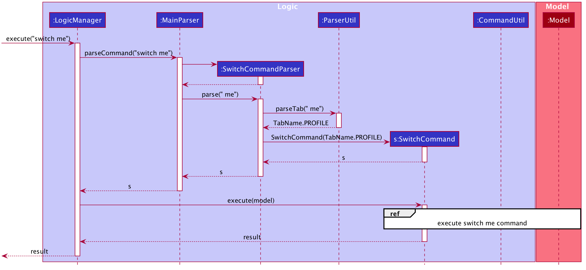

<p align="center">The process of how <code>SwitchCommand</code> interacts with the model.</p>

<p align="center">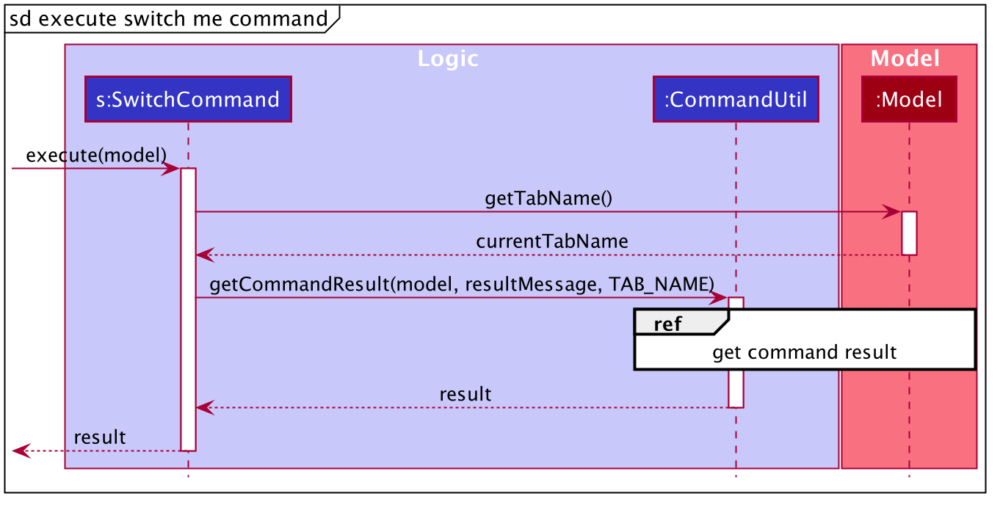</p>

This is how the `CommandUtil#getCommandResult()` method works upon execution:
1. The current tab that the user is viewing is obtained via the `Model#getTabName()` method.
2. The input tab will be check against the current tab. <br/>
 2a. If both the tabs are the same, a `CommandResult` with a same tab message is return.
 2b. If both the tabs are different, we will change the tab to the input's tab name via `Model#setTabName()`. A `CommandResult` with a success message is return.

<p align="center">The process of how <code>getCommandResult</code>.</p>

<p align="center">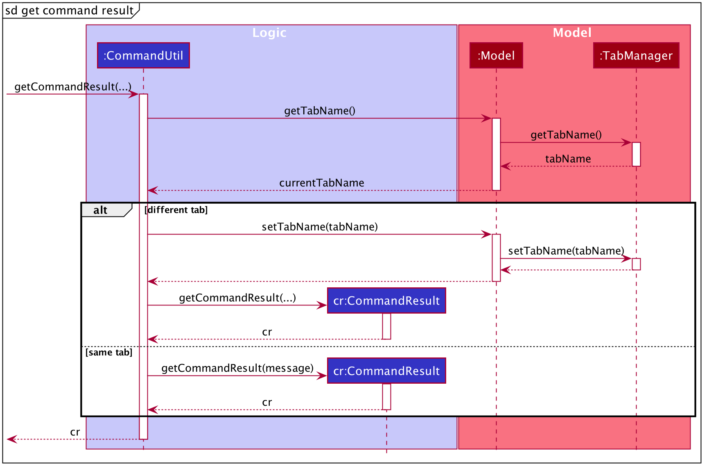</p>

The following activity diagram summarizes what happens when a user executes a switch command:

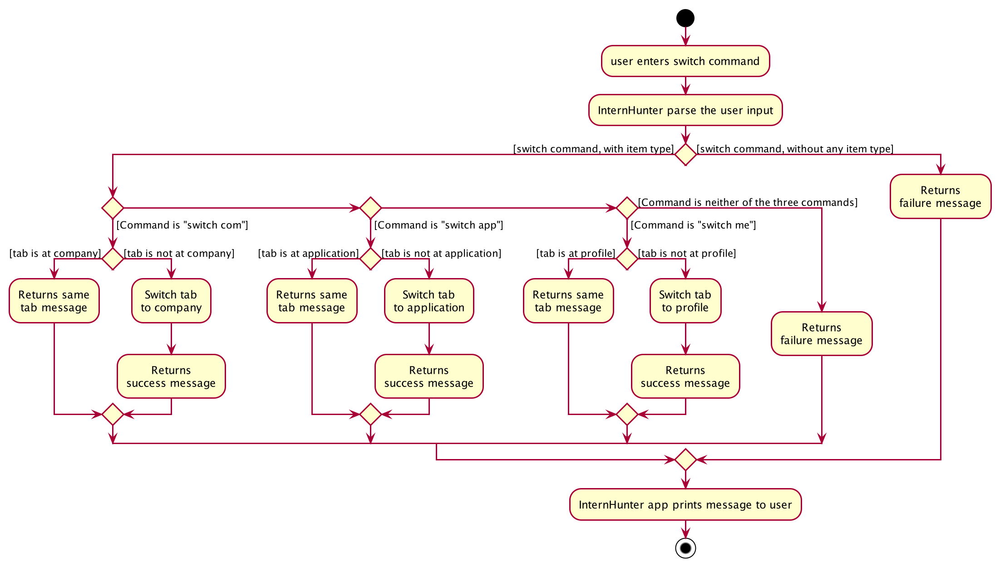

The above activity diagram shows the logic and the path execution when the switch command is executed. The code will check if there is any missing input or if the input is not one of the three mentioned in the `Command format` above. If the aforementioned 2 conditions are not met, an error message is displayed. If the input is one of the three mentioned above in the `Command format`, there will be further checks if the user are already in the same tab.

#### Design considerations
#### Aspect: Should the tabs be allowed to change only by the `SwitchCommand`.
* **Alternative 1 (current choice):** Allow the switch of tabs to not only be accessible via the switch command, but rather extract it out for all commands excluding `exit` and `help`.
    * Pros:
        * Allows user to type once instead of twice when executing a single command and wanting to view it. (This optimzation is to allow for a faster way to type and view the changes). <br/>
        * By abstract the method out from switch command, it obeys the DRY (Don't Repeat Yourself) principle as all the commands will be calling a single method.
        * This allows and obeys the Open-Close princple as new implementation of commands can just be calling this single method at the end.
        * Allows user to have a second alternative to switch tabs for just viewing purpose.
    * Cons:
        * User might switch tab accidentally because of inputting the wrong `TYPE`.
        * Increases some form of coupling between all commands as they are now linked to this single method.
* **Alternative 2:** Only allow switch command to be the only way to switch tabs.
    * Pros:
        * This introduces a "type-safe" checks like in Java where only if the user is in the correct tab, then he or she will be able to add items to that item type. <br/>
    * Cons:
        * This introduces the need to type twice in order to view the execution of the command.

### Storage Feature

#### What it is
After a command is successfully executed, InternHunter automatically saves users' data to JSON files. Moreover, 
everytime the `GuiSettings` is modified, InternHunter updates the user preferences JSON file. Users can transfer or 
backup the JSON files manually. The storage component is responsible for both reading and saving the data.

#### Implementation
InternHunter uses Jackson, a high-performance JSON processor for Java. It can  serialize Java objects into JSON and 
deserialize JSON into Java objects. InternHunter's model has 4 different types of data: `ApplicationItem`, 
`CompanyItem`, `InternshipItem`, and `ProfileItem`. They first need to be converted to Jackson-friendly versions of 
themselves, where each field is a string or another Jackson-friendly object. User preference is saved as a `UserPrefs` 
object.
 
 [Storage structure diagram](#storage-class-diagram)
 
 * `Storage` handles the storage for all `Item` lists and user preferences.
 * `UserPrefsStorage` handles the storage for user preferences.
 * `ItemListStorage` handles the storage for `Item` lists.
 * `JsonSerializableItemList` represents a Jackson-friendly version of an `Item` list.
 * `JsonAdaptedItem` represents a Jackson-friendly version of an `Item`.
 
 
 
 `JsonAdaptedItem` is an abstract class representing Jackson-friendly version of the `Item` class in the model component.
  It has one method `toModelType()` which convert itself to an `Item` object. There are 4 classes extending 
  `JsonAdaptedItem`:
  * `JsonAdaptedApplicationItem` the Jackson-friendly version of `ApplicationItem`.
  * `JsonAdaptedCompanyItem` the Jackson-friendly version of `CompanyItem`.
  * `JsonAdaptedInternshipItem` the Jackson-friendly version of `InternshipItem`.
  * `JsonAdaptedProfileItem` the Jackson-friendly version of `ProfileItem`.
  
InternHunter automatically saves user data after every command. The following sequence diagram demonstrates how
InternHunter does it. Let `commandString` be any valid command string.
  
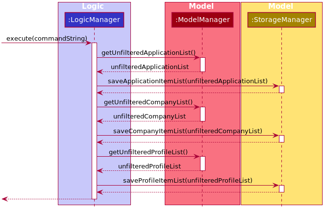
  
#### Design considerations

##### Aspect: How to handle 3 types of 'Item' list

InternHunter maintains 3 types of `Item` list: `ApplicationItem`, `CompanyItem`, and `ProfileItem` lists.
Both `ItemListStorage` and `JsonSerializableItemList` use  the same logic regardless of the `Item` type.
* **Alternative 1: current choice**: Creates a base abstract class `JsonAdaptedItem` and makes `ItemListStorage` 
and `JsonSerializableItemList` use generics.
    * Pros: 
        * Adheres to OOP principle, polymorphism.
        * Less code duplication.
        * Makes adding a new `Item` type easy. To be able to save and read a new `Item` type, only a new 
        class representing its Jackson-friendly version needs to be created.
        * Makes further extension to the `ItemListStorage` and `JsonSerializableItemList` faster.

    * Cons:
        * More complicated as Jackson does not provide a direct way to convert a generic object to its JSON format.

* **Alternative 2**: Each `Item` type has their own `ItemListStorage` and `JsonSerializableItemList`.
    * Pros:
        * Easier to implement.
    
    * Cons:
        * Much longer code with much duplication.
        * Adding a new `Item` type requires at least 3 new classes to be made.
        * Extending the `ItemListStorage` and `JsonSerializableItemList` class would require changes to all the
        different versions corresponding to the different `Item` types.

### Clear Feature

#### What it is
In the beginning, user can see how the app works with sample data. After that, user can decide to 
clear all the entries in InternHunter with just a `clear` command.

#### Implementation

The following diagram illustrates whether InternHunter use sample data.


When user enters the `clear` command, InternHunter will reset all three lists. Here is a sequence diagram showcasing how
InternHunter does it.

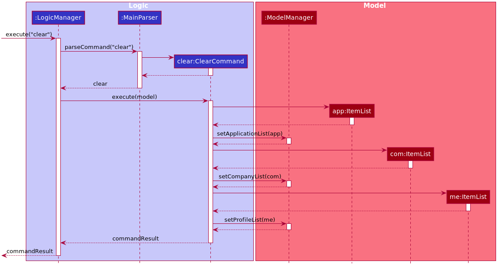

#### Design considerations

##### Aspect: How to clear the lists

InternHunter only lets users create applications for internships already added to companies.

* **Alternative 1: current choice**: Clear all three lists at once.
    * Pros: 
        * Guarantees data consistency.
        
    * Cons:
        * Less freedom for the users.

* **Alternative 2**: Each list can be cleared individually.
    * Pros:
        * Users can choose which lists to be cleared.
    
    * Cons:
        * High risk of data inconsistency due to the linkage between company and application lists.
       
## **Appendix**
### Appendix A: Product Scope

**Target user profile**:

* university students applying for tech internships
* prefer desktop apps over other types
* can type fast
* prefers typing to mouse interactions
* is reasonably comfortable using CLI apps

**Value proposition**: Improves your planning, confidence and readiness for tech-related internship applications by
 improving your interview skills and search strategy.

### Appendix B: User Stories

Priorities: High (must have) - `* * *`, Medium (nice to have) - `* *`, Low (unlikely to have) - `*`

| Priority | As a …​    | I want to …​                                                   | So that I can…​                                                                   |
| -------- | ---------- | -------------------------------------------------------------- | --------------------------------------------------------------------------------- |
| `* * *`  | new user   | see usage instructions                                         | refer to instructions when I forget how to use the app                            |
| `* * *`  | user       | get error feedback when a command fails                        | know what went wrong                                                              |
| `* * *`  | user       | maintain a list of company profiles                            | keep track of companies that I'm interested in                                    |
| `* * *`  | user       | add a company profile                                          | keep track of companies that I'm interested in                                    |
| `* * *`  | user       | delete a company profile                                       | remove company profiles that I no longer need / am no longer interested in        |
| `* * *`  | user       | edit a company profile                                         | keep my company profiles updated and accurate                                     |
| `* * *`  | user       | view a company profile                                         | see its details                                                                   |
| `* * *`  | user       | add an internship to a company profile                         | keep track of the internships that that company is offering                       |
| `* * *`  | user       | delete an internship from a company profile                    | remove erroneous / outdated entries                                               |
| `* * *`  | user       | edit an internship from a company profile                      | keep the list of internships that a company offers updated and accurate           |
| `* * *`  | user       | view a company’s internships when I view their profile         | see what internships they are offering                                            |
| `* * *`  | user       | maintain a list of my internship applications                  | keep track of them                                                                |
| `* * *`  | user       | add an internship application                                  | keep track of the internships that I have applied for                             |
| `* * *`  | user       | delete an internship application                               | remove internship applications that I no longer need / am no longer interested in |
| `* * *`  | user       | edit an internship application                                 | keep my internship applications updated and accurate                              |
| `* * *`  | user       | view an internship application                                 | see its details                                                                   |
| `* * *`  | user       | record and see an internship application's status              | keep track of them                                                                |
| `* * *`  | user       | save the dates of my upcoming interviews                       | keep track of them                                                                |
| `* * *`  | user       | maintain a user profile                                        | have an overview of my experience, skills and achievements                        |
| `* * *`  | user       | add information to my user profile                             | keep my user profile updated and accurate                                         |
| `* * *`  | user       | delete information from my user profile                        | keep my user profile updated and accurate                                         |
| `* * *`  | user       | edit information in my user profile                            | keep my user profile updated and accurate                                         |
| `* * *`  | user       | view information in my user profile                            | see its details                                                                   |
| `* *`    | user       | navigate the application easily through a clear user interface |                                                                                   |
| `* *`    | user       | get fast feedback from the app                                 |                                                                                   |
| `* *`    | user       | clears all entries from InterhHunter                           | start from a clean slate
### Appendix C: Use Cases

(For all use cases below, the **System** is `InternHunter` and the **Actor** is the `user`)

#### Use case: UC01 - Add a company

Guarantees: Addition of company is successful

**MSS**

1. User requests to add a company and provides details.
2. InternHunter adds the company to the list of companies.<br/>
Use case ends.

**Extensions**

 1a. InternHunter detects an error in the input format. <br/>
  1a1. InternHunter displays an error message and informs the user of the valid input format. <br/>
  Use case resumes from step 1.
    		
#### Use case: UC02 - Delete a company

Precondition: User already has an existing list of companies <br/>
Guarantees: Deletion of company is successful

**MSS**

1. User requests to delete a company.
2. InternHunter removes the company from the list of companies.<br/>
Use case ends.
    
**Extensions**

 1a. InternHunter detects an error in the input format. <br/>
  1a1. InternHunter displays an error message and informs the user of the valid input format. <br/>
  Use case resumes from step 1.

 1b. InternHunter detects an invalid index. <br/>
  1b1. InternHunter displays an error message and informs the user that the index is out of bounds. <br/>
  Use case resumes from step 1.

#### Use case: UC03 - Edit a company

Precondition: User already has an existing list of companies <br/>
Guarantees: Editing of company is successful

**MSS**

1. User requests to edit the details of a company and provides details.
2. InternHunter updates the details of the company. <br/>
Use case ends.

**Extensions**

 1a. InternHunter detects an error in the input format. <br/>
  1a1. InternHunter displays an error message and informs the user of the valid input format. <br/>
  Use case resumes from step 1.

 1b. InternHunter detects an invalid index. <br/>
  1b1. InternHunter displays an error message and informs the user that the index is out of bounds. <br/>
  Use case resumes from step 1.

#### Use case: UC04 - View a company

Precondition: User already has an existing list of companies <br/>
Guarantees: Viewing of company is successful

**MSS**

1. User requests to view a company.
2. InternHunter displays the company.<br/>
Use case ends.

**Extensions**

 1a. InternHunter detects an error in the input format. <br/>
  1a1. InternHunter displays an error message and informs the user of the valid input format. <br/>
  Use case resumes from step 1.

 1b. InternHunter detects an invalid index. <br/>
  1b1. InternHunter displays an error message and informs the user that the index is out of bounds. <br/>
  Use case resumes from step 1.

#### Use case: UC05 - Add an internship

Precondition: User already has an existing list of companies <br/>
Guarantees: Addition of internship is successful

**MSS**

1.  User requests to add an internship to a company and provides the index and relevant details.
2.  InternHunter adds the internship to the list of internships of the company. <br/>
    Use case ends.

**Extensions**

 1a. InternHunter detects an error in the input format. <br/>
  1a1. InternHunter displays an error message and informs the user of the valid input format. <br/>
  Use case resumes from step 1.

 1b. InternHunter detects an invalid index. <br/>
  1b1. InternHunter displays an error message and informs the user that the index is out of bounds. <br/>
  Use case resumes from step 1.

#### Use case: UC06 - Delete an internship

Precondition: User already has an existing list of internships in a company <br/>
Guarantees: Deletion of internship is successful

**MSS**

1.  User requests to delete an internship of a company and provides the index.
2.  InternHunter removes the internship from the list of internships in a company. <br />
    Use case ends.

**Extensions**

 1a. InternHunter detects an error in the input format. <br/>
  1a1. InternHunter displays an error message and informs the user of the valid input format. <br/>
  Use case resumes from step 1.

 1b. InternHunter detects an invalid index. <br/>
  1b1. InternHunter displays an error message and informs the user that the index is out of bounds. <br/>
  Use case resumes from step 1.
  
#### Use case: UC07 - Edit an internship

Precondition: User already has an existing list of internships in a company <br/>
Guarantees: Editing of internship is successful

**MSS**

1.  User requests to edit the details of an internship and inputs the index and details.
2.  InternHunter edits the details of the internship, and updates the list. <br />
    Use case ends.

**Extensions**

 1a. InternHunter detects an error in the input format. <br/>
  1a1. InternHunter displays an error message and informs the user of the valid input format. <br/>
  Use case resumes from step 1.

 1b. InternHunter detects an invalid index. <br/>
  1b1. InternHunter displays an error message and informs the user that the index is out of bounds. <br/>
  Use case resumes from step 1.

#### Use case: UC08 - Add an application

Precondition: User already has an existing list of internships in a company <br/>
Guarantees: Adding of application is successful

**MSS**

1.  User requests to apply for an internship and provides the index and relevant details.
2.  InternHunter adds the application to the list of applications and prompts the user to switch to the Applications
tab to view the newly added application. <br/>
    Use case ends.

**Extensions**

 1a. InternHunter detects an error in the input format. <br />
  1a1. InternHunter displays an error message and informs the user of the valid input format. <br />
  Use case resumes from step 1.

 1b. InternHunter detects an invalid index. <br />
  1b1. InternHunter displays an error message and informs the user that the index is out of bounds. <br />
  Use case resumes from step 1.

#### Use case: UC09 - Delete an application

Precondition: User already has an existing list of applications <br />
Guarantees: Deletion of application is successful

**MSS**

1.  User requests to delete an application and provides the index.
2.  InternHunter removes the application from the list of applications. <br />
    Use case ends.

**Extensions**

 1a. InternHunter detects an error in the input format. <br />
  1a1. InternHunter displays an error message and informs the user of the valid input format. <br />
  Use case resumes from step 1.

 1b. InternHunter detects an invalid index. <br />
  1b1. InternHunter displays an error message and informs the user that the index is out of bounds. <br />
  Use case resumes from step 1.

#### Use case: UC10 - Edit an application

Precondition: User already has an existing list of applications <br />
Guarantees: Editing of application is successful

**MSS**

1.  User requests to edit the details of an application and inputs the index and details.
2.  InternHunter edits the details of this application and the list is updated accordingly. <br />
    Use case ends.

**Extensions**

 1a. InternHunter detects an error in the input format. <br />
  1a1. InternHunter displays an error message and informs the user of the valid input format. <br />
  Use case resumes from step 1.

 1b. InternHunter detects an invalid index. <br />
  1b1. InternHunter displays an error message and informs the user that the index is out of bounds. <br />
  Use case resumes from step 1.

#### Use case: UC11 - View an application

Precondition: User already has an existing list of applications <br />
Guarantees: Viewing of application is successful

**MSS**

1.  User requests to view the details of an application and provides the index.
2.  InternHunter shows the details of this application. <br />
    Use case ends.

**Extensions**

 1a. InternHunter detects an error in the input format. <br />
  1a1. InternHunter displays an error message and informs the user of the valid input format. <br />
  Use case resumes from step 1.
  
 1b. InternHunter detects an invalid index. <br />
  1b1. InternHunter displays an error message and informs the user that the index is out of bounds. <br />
  Use case resumes from step 1.

#### Use case: UC12 - Add user profile item

Guarantees: Addition of user profile item is successful

**MSS**

1.  User requests to add a user profile item to the user profile and provides details.
2.  InternHunter adds the user profile item to the user profile. <br />
    Use case ends.

**Extensions**

 1a. InternHunter detects an error in the input format. <br />
  1a1. InternHunter displays an error message and informs the user of the valid input format. <br />
  Use case resumes from step 1.

#### Use case: UC13 - Delete a user profile item 

Precondition: User already has an existing list of user profile items <br/>
Guarantees: Deletion of user profile item is successful

**MSS**

1.  User requests to delete a user profile item from the user profile.
2.  InternHunter removes the user profile item from the user profile. <br/>
    Use case ends.

**Extensions**

 1a. InternHunter detects an error in the input format. <br/>
  1a1. InternHunter displays an error message and informs the user of the valid input format. <br/>
  Use case resumes from step 1.

 1b. InternHunter detects an invalid index. <br/>
  1b1. InternHunter displays an error message and informs the user that the index is out of bounds. <br/>
  Use case resumes from step 1.

#### Use case: UC14 - Edit a user profile item

Precondition: User already has an existing list of user profile items <br/>
Guarantees: Editing of user profile item is successful

**MSS**

1.  User requests to edit the details of a user profile item and provides details.
2.  InternHunter edits the user profile item in the user profile. <br/>
    Use case ends.

**Extensions**

 1a. InternHunter detects an error in the input format. <br/>
  1a1. InternHunter displays an error message and informs the user of the valid input format. <br/>
  Use case resumes from step 1.

 1b. InternHunter detects an invalid index. <br/>
  1b1. InternHunter displays an error message and informs the user that the index is out of bounds. <br/>
  Use case resumes from step 1.

#### Use case: UC15 - View a user profile item

Precondition: User already has an existing list of user profile items <br/>
Guarantees: Viewing of user profile item is successful

**MSS**

1.  User requests to view the details of a user profile item.
2.  InternHunter shows the details of this user profile item. <br/>
    Use case ends.
    
**Extensions**

 1a. InternHunter detects an error in the input format. <br/>
  1a1. InternHunter displays an error message and informs the user of the valid input format. <br/>
  Use case resumes from step 1.

 1b. InternHunter detects an invalid index. <br/>
  1b1. InternHunter displays an error message and informs the user that the index is out of bounds. <br/>
  Use case resumes from step 1.

#### Use case: UC16 - Switch tabs

**MSS**

1.  User requests to switch the tab of the screen.
2.  InternHunter switches to the requested tab. <br/>
    Use case ends.

**Extensions**

 1a. InternHunter detects an error in the input format. <br/>
  1a1. InternHunter displays an error message and informs the user of the valid input format. <br/>
  Use case resumes from step 1.

#### Use case: UC17 - Clear all entries

Guarantees: All entries in InternHunter will be cleared

**MSS**

1.  User requests to clear all entries.
2.  InternHunter deletes all of its entries. <br/>
    Use case ends.

#### Use case: UC18 - Get help

Guarantees: User will get directions to the user guide

**MSS**

1.  User requests to see the help window.
2.  InternHunter displays help message directing user to user guide. <br/>
    Use case ends.


#### Use case: UC19 - Exit 

**MSS**

1.  User requests to exit InternHunter.
2.  InternHunter prompts for confirmation.
3.  User confirms intention to exit.
4.  InternHunter exits. <br/>
    Use case ends.

**Extensions**
 2a. User chooses to cancel the confirmation. <br/>
  Use case ends.
    
### Appendix D: Non-Functional Requirements

* Should be for a single user i.e. (not a multi-user product).
* The data should be stored locally and should be in a human editable text file.
* The software should work without requiring an installer.
* Should work on any mainstream OS as long as it has Java 11 or above installed.
* Should work on both 32-bit and 64-bit environment.
* Should only use third-party frameworks or libraries which are free, open-source and have permissive license term and 
do not require installation by user of the software.
* A user with above average typing speed for regular English text should be able to accomplish most of the tasks faster 
using commands than using the mouse.
* Should be a result of evolving and morphing the given code base.
* Should be developed in a breadth-first incremental manner over the project duration.

### Appendix E: Glossary

* **OS**: Operating System
* **Mainstream OS**: Windows, Linux, Unix, OS-X
* **Json**: JavaScript Object Notation

### Appendix F: Sequence Diagrams

<p align="center">Sequence diagram for HandleDeleteDisplaySwitchIndex</p>

<p id="handle-delete-display-switch-index-sequence-diagram" align="center">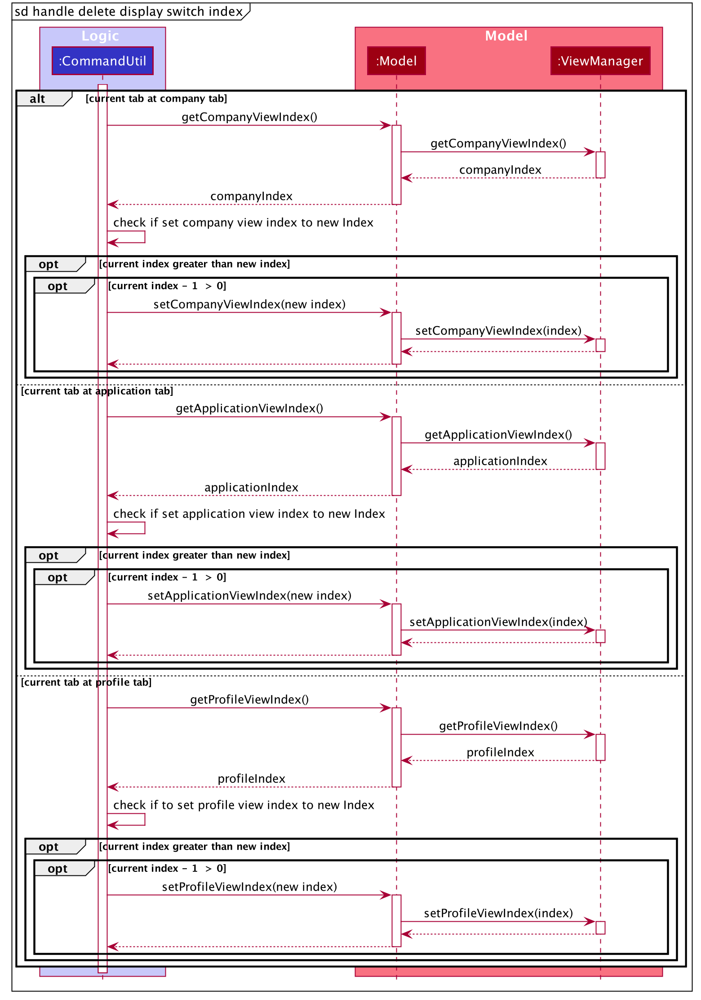</p>


--------------------------------------------------------------------------------------------------------------------
