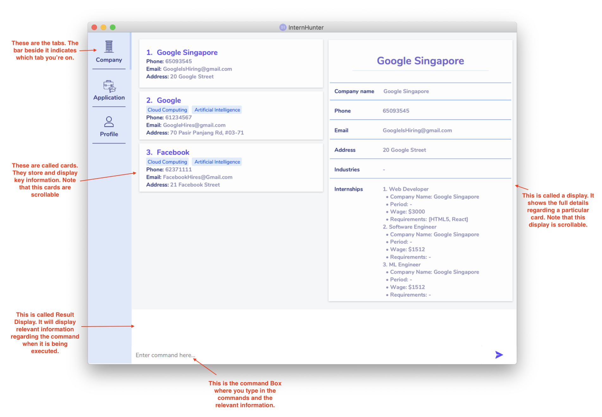
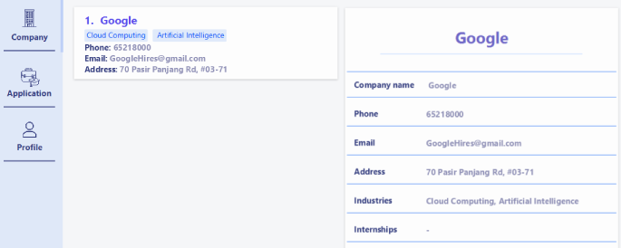
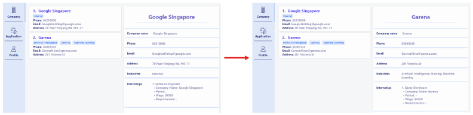
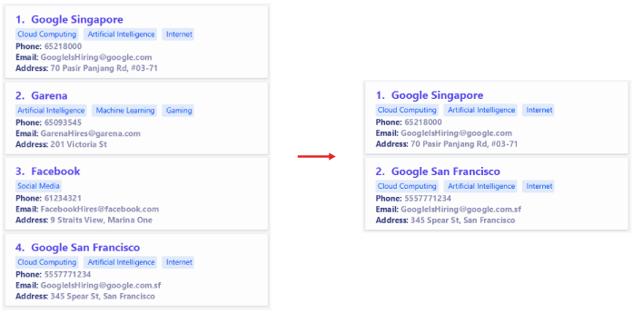
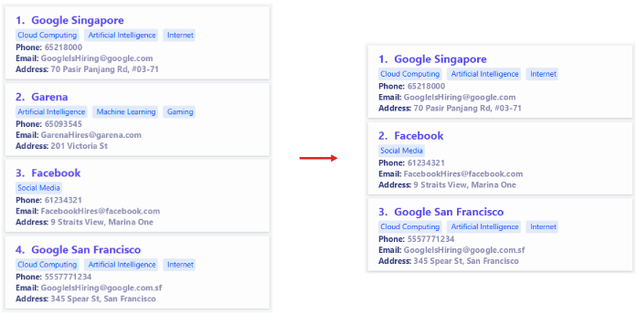
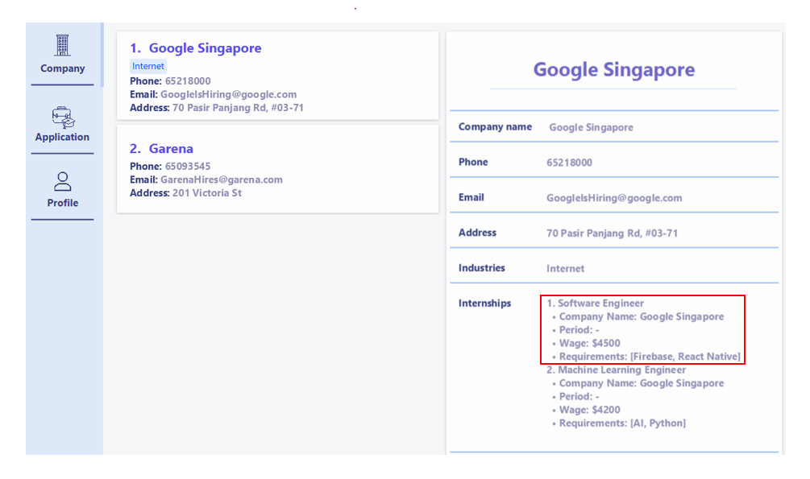
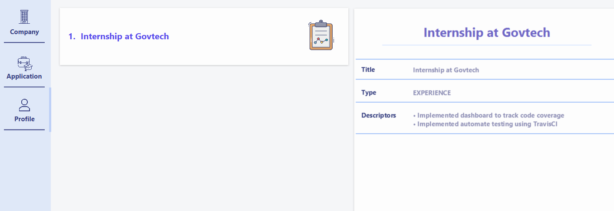
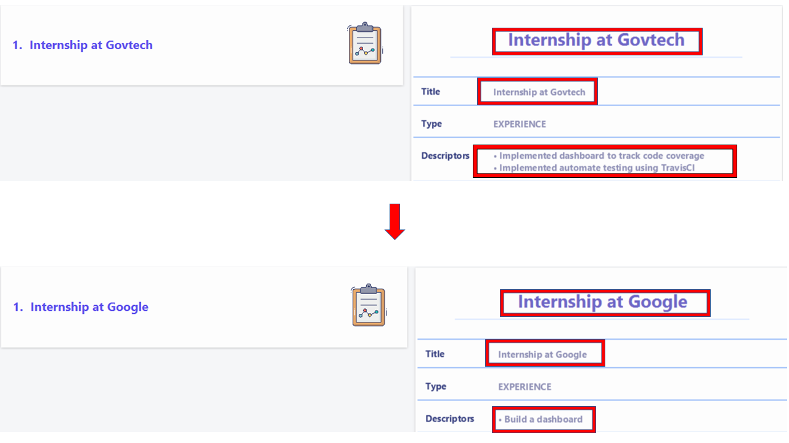
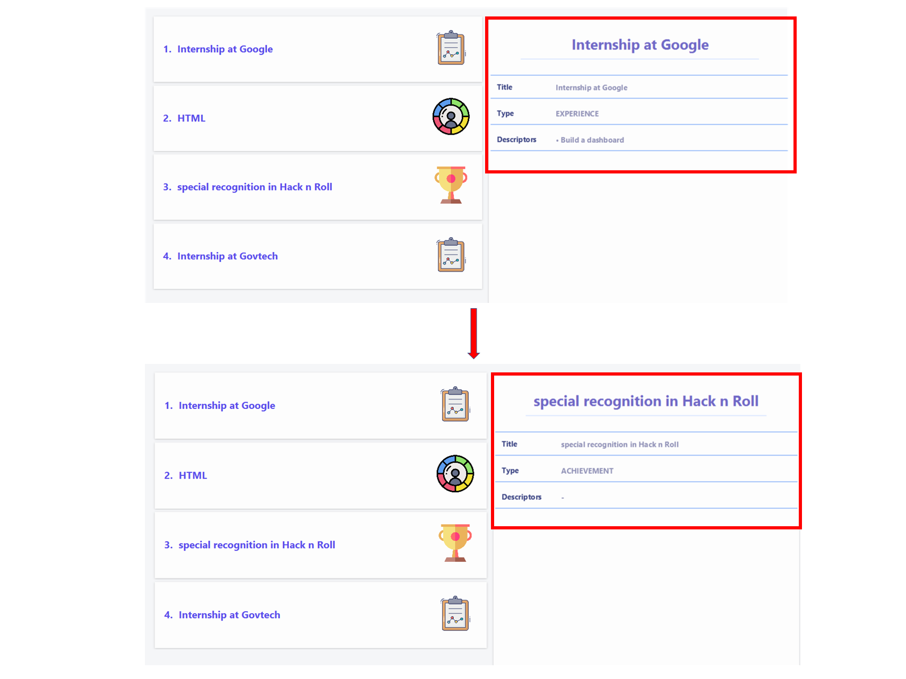

---

# Welcome to the InternHunter User Guide

## Table Of Contents

[1. Introduction](#introduction)  
 [1.1. Overview](#overview)  
[2. Quick start](#quick-start)  
[3. About](#about)  
[4. Features](#features)  
 [4.1. Company](#company)  
  [4.1.1. Adding a company: `add com`](#adding-a-company-add-com)  
  [4.1.2. Deleting a company: `delete com`](#deleting-a-company-delete-com)  
  [4.1.3. Editing a company: `edit com`](#editing-a-company-edit-com)  
  [4.1.4. Viewing a company: `view com`](#viewing-a-company-view-com)  
  [4.1.5. Finding companies: `find com`](#finding-companies-find-com)  
  [4.1.6. Listing all companies: `list com`](#listing-all-companies-list-com)  
 [4.2. Internship](#internship)  
  [4.2.1. Adding an internship: `add int`](#adding-an-internship-add-int)  
  [4.2.2. Deleting an internship: `delete int`](#deleting-an-internship-delete-int)  
  [4.2.3. Editing an internship: `edit int`](#editing-an-internship-edit-int)  
 [4.3. Application](#application)  
  [4.3.1. Applying for an internship: `add app`](#applying-for-an-internship-add-app)  
  [4.3.2. Deleting an application: `delete app`](#deleting-an-application-delete-app)  
  [4.3.3. Updating an application: `edit app`](#updating-an-application-edit-app)  
  [4.3.4. Viewing an application: `view app`](#viewing-an-application-view-app)  
  [4.3.5. Finding applications: `find app`](#finding-applications-find-app)  
  [4.3.6. Listing all applications: `list app`](#listing-all-applications-list-app)  
 [4.4. Profile](#profile)  
  [4.4.1. Adding item to profile: `add me`](#adding-item-to-profile-add-me)  
  [4.4.2. Deleting item in profile: `delete me`](#deleting-item-in-profile-delete-me)  
  [4.4.3. Editing item in profile: `edit me`](#editing-item-in-profile-edit-me)  
  [4.4.4. Viewing item in profile: `view me`](#viewing-item-in-profile-view-me)  
  [4.4.5. Finding items in profile: `find me`](#finding-items-in-profile-find-me)  
  [4.4.6. Listing all profile items: `list me`](#listing-all-items-in-profile-list-me)  
 [4.5 General](#general)  
  [4.5.1. Generating matching internships: `match`](#generating-matching-internships-match)  
  [4.5.2. Switching Tabs: `switch`](#switching-tabs-switch)  
  [4.5.3. Viewing Help: `help`](#viewing-help-help)  
  [4.5.4. Clearing all entries: `clear`](#clearing-all-entries-clear)  
  [4.5.5. Exiting the program: `exit`](#exiting-the-program-exit)  
[5. FAQ](#faq)  
[6. Command Summary](#command-summary)  

---

## **Introduction**

**InternHunter is a CLI-centric desktop application which aids university students in applying for internships**.
It lets you manage your own customisable collection of companies, internships, internship applications and your 
user profile, so that you can keep track of internships that you are interested in - all from one centralised place.

Never lose track of a good internship opportunity again.

This User Guide will help you - the user - find out about what InternHunter is and how to use it. It'll get you up and 
running with the app in your pursuit to land that desired internship. Let's dive in.

### **Overview**

You're searching for an internship.

You've got 100 tabs open in Chrome.

You're viewing multiple internship listings and companies' details, comparing salaries and job requirements across 
webpages all while trying to recall your own skill set and finding what role best suits you.

It's a mess.

InternHunter is here to fix that. Here's how:

InternHunter lets you record crucial information that you would want to keep track of during your internship hunting 
process by managing a collection of four types of items:

Item | Alias | Attributes | What it represents
-----|-------|------------|-------------------
Company | com | company name, phone number, email, address, industry types, internships | A company offering internships
Internship | int | company name, job title, period, wage, requirements | An internship offered by a company
Application | app | internship, status, status date | An internship application that you applied for
Profile Item | me | category, title, descriptors | An item in your profile

And here's what you can do:
1. When you find a company that you are interested in, add it to your list of companies with the:  
[`add com` command](#adding-a-company-add-com)
2. Next, note down the internships offered by that company that interest you with the:  
[`add int` command](#adding-an-internship-add-int)
3. And once you've applied for an internship, record it down to keep track of it with the:  
[`add app` command](#applying-for-an-internship-add-app)

You can also keep track of your achievements, experience and skills in your own [profile](#profile). Along with the 
[skills matching feature](#generating-matching-internships-match), it will aid you in creating a tailored resume for each 
application and figure out which internship is the best fit for you.

Simple? Well that's the InternHunter flow.

Now, along the way you're probably going to want to edit, delete and look through your collection of items - 
InternHunter supports all those features and more.

Ready to begin? Let's get hunting.

## **Quick start**

1. Ensure you have Java `11` or above installed in your Computer.

1. Download the latest `InternHunter.jar` [here](https://github.com/AY2021S1-CS2103T-T15-4/tp/releases/tag/v1.2).

1. Copy the file to the folder you want to use as the _home folder_ for InternHunter.

1. Double-click the file to start the app or run `java -jar InternHunter.jar` from the terminal.

1. Refer to [About](#about) to understand certain terminologies and usage of InternHunter.

1. The [Features](#features) available in the current version of InternHunter are listed below.

--------------------------------------------------------------------------------------------------------------------

## **About**

This section will bring you through the [GUI](#understanding-the-gui), [technical terminologies](#understanding-the-technical-terminologies), as well as commonly used [symbols](#understanding-the-symbols).

#### Understanding the GUI

#### Understanding the technical terminologies

Word | What it means
-----|---------------
Commands | Words that determines the action of InternHunter.
Command word | The first word of every command.
Parameters | Information that is supplied by you.
Execute | Typing the information into the command box and pressing enter.

#### Understanding the symbols

Symbol | What it means
-------|--------------
:information_source: | Important information to take note.
:bulb: | Extra tip.
`add` | Words that have a grey highlighted background are commands that can be keyed into the command box.
*italics* | Words in italics represent additional information.

#### Understanding the usage of the commands

:information_source: **Notes about the commands:** 

* Words in `UPPER_CASE` are the parameters to be supplied by you. 
  e.g. in `add com n/COMPANY_NAME p/PHONE_NUMBER e/EMAIL a/ADDRESS [t/INDUSTRY]...`, `COMPANY_NAME`, `PHONE_NUMBER`, `EMAIL`, `ADDRESS`, `INDUSTRY`,
  are parameters which can be used as `add com n/Google p/65218000 e/GoogleHire@gmail.com a/70 Pasir Panjang Rd, #03-71 t/Cloud Computing t/Artificial Industry`.

* Items in square brackets `[]` are optional. 
  e.g `add int INDEX j/JOB_TITLE w/WAGE [p/PERIOD] [r/REQUIREMENT]...` can be used as   `add int 1 j/Software Engineer` or
  `add int 3 j/Web Developer r/React w/3000 r/HTML5`.

* Items with `...`​ after them can be used multiple times including zero times. 
  e.g. `[r/REQUIREMENT]...` can be used as `r/Rust`, `r/React native r/JavaScript` etc.

* Parameters can be in any order. 
  e.g. if the command specifies `p/PERIOD w/WAGE`, `w/WAGE p/PERIOD` is also acceptable. Note that the command word and the item type should still come first.

* `INDEX` refers to the index of the item (Company, Application, or Profile Item) in its respective displayed list of
 items unless stated otherwise. All `INDEX`es are positive integers *(1, 2, 3, ...)*. 
 

--------------------------------------------------------------------------------------------------------------------

## **Features**

### **Company**

This represents a company, any company, but typically one that you are interested in applying for an internship to.
You can record and maintain a company's name, phone number, email address, physical address, and its industry types.
You can then later specify what internships the company is offering by using the [internship commands](#internship).
*(Note that you must create a company first before you can create internships that the company offers)*

#### Adding a company: `add com`

Adds a company to your list of companies.

Format: `add com n/COMPANY_NAME p/PHONE_NUMBER e/EMAIL a/ADDRESS [t/INDUSTRY]...`

Examples:
- `add com n/Garena a/201 Victoria St e/GarenaHires@garena.com p/65093545` *(notice that the company's industry types
 need not be specified)*
- Executing `add com n/Google p/65218000 e/GoogleHires@gmail.com a/70 Pasir Panjang Rd, #03-71 t/Cloud Computing t/Artificial Intelligence`
on an empty company list will add the company as follows:  

#### Deleting a company: `delete com`

Deletes a company from your list of companies. All internships and applications associated with this company will also be deleted.

Format: `delete com INDEX`

Example:
- `delete com 5`

#### Editing a company: `edit com`

Edits a company in your list of companies.

Format: `edit com INDEX [n/COMPANY_NAME] [p/PHONE_NUMBER] [e/EMAIL] [a/ADDRESS] [t/INDUSTRY]...`
- At least one of the optional fields must be provided.
- Existing values will be updated to the input values.
- When editing industry types, the existing industry types get removed i.e. industry types do not accumulate.
- You can remove all of a company’s industry types by simply typing `t/` without specifying anything after it.

Examples:
- `edit com 2 p/61234567`
- For the following example, executing `edit com 1 n/Google Singapore e/GoogleIsHiring@google.com t/Internet` will
 edit company 1 as follows:  
   
 *(Notice that by editing industry types, the existing industry types get replaced i.e. industry types do not
  accumulate)*

#### Viewing a company: `view com`

Selects a company in your list of companies to show in detail on the right panel.

Format: `view com INDEX`

Examples:
- `view com 3`
- Suppose you are currently viewing the first company and you want to view the second company. Executing `view com 2` 
will update the right panel to display the second company:  
     

#### Finding companies: `find com`

Finds all companies in your list of companies whose names contain any of the given keywords.

Format: `find com KEYWORD [ANOTHER_KEYWORD]...`
- Only the company name will be searched for.
- The search is case-insensitive. e.g. `google` will match `Google`.
- Companies with names matching at least one keyword will be returned. e.g. `Google Facebook` will return companies
 whose names contain the word `Google` *or* `Facebook`.
- The order of the keywords does not matter. e.g. `Google Facebook` and `Facebook Google` will return the same results.
- Only full words will be matched. e.g. `Googl` will not match `Google`.

Examples:
- `find com Amazon`
- Suppose you have this list of companies. Executing `find com google` will update the list to show matching
 companies:  
       
     
     And executing `find com google facebook` will return the following:  
       

#### Listing all companies: `list com`

Lists out **all** companies in your list of companies. After using the `find com` command, you would have likely
narrowed your list of companies down to a few search results. Use the `list com` command to revert to seeing all the
companies in your list.

Format: `list com`

### **Internship**

Note: You must be on the **Company** tab in order to execute these commands.

#### Adding an internship: `add int`

Adds an internship to a company.

Format: `add int INDEX j/JOB_TITLE w/WAGE [p/PERIOD] [r/REQUIREMENT]...`
- `PERIOD` can refer to any word (e.g. `3 months`, `Summer break`).

Examples:
- `add int 3 j/Web Developer w/3000 r/React r/HTML5`
- `add int 1 j/Machine Learning Engineer w/4700` 

#### Deleting an internship: `delete int`

Deletes an internship from a company. The application (if any) made with this internship will also be deleted.
 
Format: `delete int INDEX i/INDEX` 
- `INDEX` refers to the index of the company in the company list, and `i/INDEX` refers to the index of the
internship in the company’s list of internships.

Example:
- `delete int 3 i/2`

#### Editing an internship: `edit int`

Edits an internship from a company. The application (if any) made with this internship will also be edited.

Format:  `edit int INDEX i/INDEX [j/JOB_TITLE] [w/WAGE] [p/PERIOD] [r/REQUIREMENT]...`
- `INDEX` refers to the index of the company in the company list, and `i/INDEX` refers to the index of the
internship in the company’s list of internships.
- At least one of the optional fields must be provided.

Examples:
- `edit int 3 i/1 j/Frontend Developer`
- Executing `edit int 1 i/2 w/4800 r/Java r/Python`:

If an application is already created for the internship, it will also be edited as shown below:

### **Application**

Now that you have learnt how to manage your companies and internships, the next burning question you probably have is 
how to use InternHunter to apply, track and manage your internship applications. Read on through this section to find 
out how.

  :information_source: <strong>Note:</strong> Each application comes with a `STATUS` and `STATUS_DATE` field which indicates the
date that the `STATUS` was set/updated.

Valid `STATUS` specifiers:
- `Applied`
- `Interview`
- `Waiting`
- `Rejected`
- `Offered`
- `Accepted`

  :information_source: <strong>Note:</strong> Status added are case-insensitive

Valid `STATUS_DATE` formats:

- d-M-yy HHmm
    - e.g. `23-12-20 2230`
- d-M-yy
    - e.g. `23-12-20`
    - Time will be taken as 2359

  :information_source: <strong>Note:</strong> Dates added must be in the future

#### Applying for an internship: `add app`

Selects an internship from a company and adds it to your list of applications. If unspecified, the application’s
`STATUS` will be `Applied`, and it’s `STATUS_DATE` will be set as today’s date.

Format: `add app INDEX i/INDEX [s/STATUS] [d/STATUS_DATE]`
- Where `INDEX` refers to the index of the company in the company list, and `i/INDEX` refers to the index of the
internship in the company’s internship list.

Example:
- Suppose you are interested in applying for the Software Engineer internship in Google Singapore:

Executing `add app 1 i/1 d/24-12-2020` will apply for the internship as follows.
Note that you will be automatically switched to the application tab to view the application made:

#### Deleting an application: `delete app`

Deletes an application from your list of applications.
 
Format: `delete app INDEX` 

Example:
- `delete app 3`

#### Updating an application: `edit app`

Updates an application in your list of applications.

Format: `edit app INDEX [s/STATUS] [d/STATUS_DATE]`
- At least one of the optional fields must be provided.

Example:
- Suppose Google Singapore has replied to your application for the Software Engineer internship and has called you up 
for an interview on the 28 Dec 2020, 2pm. Executing `edit app 1 s/interview d/28-12-20 1400` will update this 
application as follows:

#### Viewing an application: `view app`

Selects an application in the list of applications to show in detail on the right panel.
 
Format: `view app INDEX`

Example:
- Suppose you are currently viewing the first application and you want to view the second application. 
Executing `view app 2` will update the right panel to display the second application:

#### Finding applications: `find app`

Finds all applications in your list of applications whose job titles contain any of the given keywords.

Format: `find app KEYWORD [ANOTHER_KEYWORD]...`
- Find command matching is the same as that used in [`find com` command](#finding-companies-find-com), except 
job titles are used in placed of company names.

Example:
- Suppose you have this list of applications. Executing `find app engineer` will update the list to show matching
applications:

#### Listing all applications: `list app`

Lists out **all** applications in your list of applications. After using the `find app` command, you would have likely
narrowed your list of applications down to a few search results. Use the `list app` command to revert to seeing
all the applications in your list.

Format: `list app`

### **Profile**

The profile feature offers you the ability to keep track and maintain your personal portfolio. It stores
profile items which are entities that describe an achievement, a past experience or a skill you have acquired.
It assists you in crafting a tailored resume for your internship applications by allowing you to find items in your
profile which are relevant to the job description through the [find feature](#finding-items-in-profile-find-me).

Each profile item belongs to 1 of 3 categories.

Valid `CATEGORY` specifiers:
- `achievement`
- `experience`
- `skill`

Each category is represented by the following icons in the UI:

| CATEGORY   | ICON 
|------------|------------------
|`achievement`| 
|`experience` | 
|`skill`      | 

Each profile item also contains a `TITLE` that describes the item, and you can optionally 
add additional `DESCRIPTOR`s to further describe the item in point form.

#### Adding item to profile: `add me`

Adds a profile item to your profile.

Format: `add me c/CATEGORY t/TITLE [d/DESCRIPTOR]...`

Examples:
* `add me c/skill t/HTML d/Learn how to create divs`
* `add me c/achievement t/special recognition in Hack n Roll`
* For example, you have just completed an internship at Govtech. Executing `add me c/experience t/Internship at
 Govtech d/Implemented automate testing using TravisCI d/Implemented dashboard to track code coverage` on an empty 
 profile will add the profile item as follows:  
 

#### Deleting item in profile: `delete me`

Deletes experience, skills or achievements descriptors from your profile.

Format: `delete me INDEX`

Example:
* `delete me 2`

#### Editing item in profile: `edit me`

Edit the experience, skills or achievements descriptors of your profile.

Format: `edit me INDEX [c/CATEGORY] [t/TITLE] [d/DESCRIPTORS]`
* At least one of the optional fields must be provided.
* Existing values will be updated to the input values.
* When editing `DESCRIPTORS`, all existing descriptors get replaced by the new specified descriptors.
* You can remove all `DESCRIPTORS` by adding d/ without anything after it.

Examples:
* `edit me 2 c/skill t/CSS d/learnt how to use flexbox`
* For example if you want to update the title and descriptor of the first item in your profile.
* Executing `edit me 1 t/Internship at Google d/Build a dashboard` will edit the profile item to: 
 
 *(Note that the existing descriptors get replaced)*
 
#### Viewing item in profile: `view me`

Selects an item in the profile to show in detail on the right panel.

Format: `view me INDEX`

Example:
* `view me 3`
* For example if you have the following profile items and you want to view the third item in your user profile. Executing `view me 3` will show the following: 

 
*(As you can see the details of the third item can be seen in the right panel)*

#### Finding items in profile: `find me`

Finds all items in your profile whose titles contain any of the specified keywords.

Format: `find me KEYWORD [ANOTHER_KEYWORD]...`
- Only the profile item's title will be searched for.
- The search is case-insensitive. e.g. `HTML` will match and return items with `html` in its title.
- Profile items with titles matching at least one keyword will be returned. e.g. `Hackathon Internship` will return
 a list of profile items whose titles contain the word `Hackathon` *or* `Internship`.
- The ordering of the keywords does not affect the outcome of the query. e.g. `Hackathon Internship` and `Internship
 Hackathon` will return the same results.
- Only full words will be matched. e.g. `Intern` will not match `Internship`.

Examples:
- `find me Internship`
- For the following example, if the profile contains the following items. Executing `find me internship` will return
 the following:  
       
     And executing `find me internship google` will return the following:  
       
     *(As you can see, the search results match at least one of the keywords specified regardless of its casing)*

#### Listing all items in profile: `list me`

Lists out all items in your profile. After using the `find me` command, you would have likely filtered 
your list of profile items down to a few search results. You can then use the `list me` command to revert to seeing 
all the items in your profile.

Format: `list me`

### **General**

#### Generating matching internships: `match`

Generates a list of internships that have requirements that matches your current set of skills.

Format: `match`
- Matching done is case-insensitive. e.g. `Python` will match `python`
- Internships with job titles matching at least one `SKILL` will be returned.
- Only full words will be matched. e.g. `React` will not match `React Native`

Example:
- Suppose you have these 2 internship lists (from 2 different companies) and profile skills in your list.
Executing `match` will generate the list of matching internships in a new window.

  :bulb: <strong>Tip:</strong> You can press Esc key to close the popup window!

#### Switching Tabs: `switch`

Switches between tabs.

Format: `switch TYPE`

There are three `TYPE`s:
* `com`
* `app`
* `me`

`com` refers to Company tab, `app` refers to Application tab, `me` refers to Profile tab.

Example: 
* `switch me`

#### Clearing all entries: `clear`
Clears all entries from InternHunter.

format: `clear`

#### Viewing Help: `help`
Displays a link to the InternHunter user guide.

Format: `help`

  :bulb: <strong>Tip:</strong> You can press Esc key to close the help window!

#### Exiting the Program: `exit`
Shows an exit confirmation dialog.

Format: `exit`

--------------------------------------------------------------------------------------------------------------------

## **FAQ**

**Where does InternHunter store its data?**  
By default, InternHunter will save all the information into a folder called data. The information is then stored into 3 different Json files: `applicationitemlist.json`, `companyitemlist.json`, `profileitemlist.json`.

**How do I transfer my data to another computer?**  
You can copy the data file and transfer it into the same directory of the other computer. InternHunter will then be able to reuse this data.

**Do I have to save my data manually?**  
There isn't a need for you to manually save your data, InternHunter will automatically save your data into the relevant json files.

**What happens if I accidentally clear all my data using `clear`?**  
Unfortunately InternHunter does not provide an `undo` method.

--------------------------------------------------------------------------------------------------------------------

## **Command summary**

### Company

Action     | Format
-----------|------------------
**Add**    | `add com n/COMPANY_NAME p/PHONE_NUMBER e/EMAIL a/ADDRESS [t/INDUSTRY]...`
**Delete** | `delete com INDEX`
**Edit**   | `edit com INDEX [n/COMPANY_NAME] [p/PHONE_NUMBER] [e/EMAIL] [a/ADDRESS] [t/INDUSTRY]...`
**View**   | `view com INDEX`
**Find**   | `find com KEYWORD [ANOTHER_KEYWORD]...`
**List**   | `list com`

### Internship

Action     | Format
-----------|------------------
**Add**    | `add int INDEX j/JOB_TITLE w/WAGE [p/PERIOD] [r/REQUIREMENT]...`
**Delete** | `delete int INDEX i/INDEX`
**Edit**   | `edit int INDEX i/INDEX [j/JOB_TITLE] [p/PERIOD] [w/WAGE] [r/REQUIREMENT]...`

### Application

Action     | Format
-----------|------------------
**Add**    | `add app INDEX i/INDEX [s/STATUS] [d/STATUS_DATE]`
**Delete** | `delete app INDEX`
**Edit**   | `edit app INDEX [s/STATUS] [d/STATUS_DATE]`
**View**   | `view app INDEX`
**Find**   | `find app KEYWORD [ANOTHER_KEYWORD]...`
**List**   | `list app`

### Profile

Action     | Format
-----------|------------------
**Add**    | `add me c/CATEGORY t/TITLE [d/DESCRIPTOR]...`
**Delete** | `delete me INDEX`
**Edit**   | `edit me INDEX [c/CATEGORY] [t/TITLE] [d/DESCRIPTOR]...`
**View**   | `view me INDEX`
**Find**   | `find me KEYWORD [ANOTHER_KEYWORD]...`
**List**   | `list me`

### General

Action     | Format
-----------|------------------
**Match**  | `match`
**Switch** | `switch TYPE`
**Clear**  | `clear`
**Help**   | `help`
**Exit**   | `exit`
