---

# Welcome to the InternHunter User Guide

## Table Of Contents

[1. Introduction](#introduction)  
 [1.1. Overview](#overview)  
[2. Quick start](#quick-start)  
[3. About](#about)  
[4. Features](#features)  
 [4.1. Company](#company)  
  [4.1.1. Adding a company: `add com`](#adding-a-company-add-com)  
  [4.1.2. Deleting a company: `delete com`](#deleting-a-company-delete-com)  
  [4.1.3. Editing a company: `edit com`](#editing-a-company-edit-com)  
  [4.1.4. Viewing a company: `view com`](#viewing-a-company-view-com)  
  [4.1.5. Finding companies: `find com`](#finding-companies-find-com)  
  [4.1.6. Listing all companies: `list com`](#listing-all-companies-list-com)  
 [4.2. Internship](#internship)  
  [4.2.1. Adding an internship to a company: `add int`](#adding-an-internship-to-a-company-add-int)  
  [4.2.2. Deleting an internship from a company: `delete int`](#deleting-an-internship-from-a-company-delete-int)  
  [4.2.3. Modifying an internship's details: `edit int`](#modifying-an-internships-details-edit-int)  
 [4.3. Application](#application)  
  [4.3.1. Applying for an internship: `add app`](#applying-for-an-internship-add-app)  
  [4.3.2. Deleting an application: `delete app`](#deleting-an-application-delete-app)  
  [4.3.3. Updating an application: `edit app`](#updating-an-application-edit-app)  
  [4.3.4. Viewing an application: `view app`](#viewing-an-application-view-app)  
  [4.3.5. Finding applications: `find app`](#finding-applications-find-app)  
  [4.3.6. Listing all applications: `list app`](#listing-all-applications-list-app)  
 [4.4. Profile](#profile)  
  [4.4.1. Adding an item to profile: `add me`](#adding-an-item-to-your-profile-add-me)  
  [4.4.2. Deleting an item from your profile: `delete me`](#deleting-an-item-from-your-profile-delete-me)  
  [4.4.3. Updating profile item details: `edit me`](#updating-profile-item-details-edit-me)  
  [4.4.4. Viewing a profile item's details in full: `view me`](#viewing-a-profile-items-details-in-full-view-me)  
  [4.4.5. Finding items in profile: `find me`](#finding-items-in-profile-find-me)  
  [4.4.6. Listing all profile items: `list me`](#listing-all-items-in-profile-list-me)  
 [4.5 General](#general)  
  [4.5.1. Generating matching internships: `match`](#generating-matching-internships-match)  
  [4.5.2. Switching Tabs: `switch`](#switching-tabs-switch)  
  [4.5.3. Viewing Help: `help`](#viewing-help-help)  
  [4.5.4. Clearing all entries: `clear`](#clearing-all-entries-clear)  
  [4.5.5. Exiting the program: `exit`](#exiting-the-program-exit)  
[5. FAQ](#faq)  
[6. Command Summary](#command-summary)  

---

## **Introduction**

**InternHunter is a CLI-centric\* desktop application which aids university students in applying
 for internships**.
It lets you manage your own customisable collection of companies, internships, internship applications and your 
user profile, so that you can keep track of internships that you are interested in - all from one centralised place.

Never lose track of a good internship opportunity again.

This User Guide will help you find out about what InternHunter is and how to use it. It'll get you started with the 
app in your pursuit to land that desired internship.

Let's dive in.

*\*If you're unfamiliar with Command-Line Interfaces (CLIs), you can find out about them [here](https://en.wikipedia.org/wiki/Command-line_interface)!*

### **Overview**

You're searching for an internship.

You've got 101 tabs open in Chrome.

You're viewing multiple internship listings and companies' details, comparing salaries and job requirements across 
webpages all while trying to recall your own skill set and finding what role best suits you.

It's a mess.

InternHunter is here to fix that. Here's how:

InternHunter lets you record crucial information that you would want to keep track of during your internship hunting 
process by managing a collection of four types of items:

Item | Alias | Attributes | What it represents
-----|-------|------------|-------------------
Company | com | company name, phone number, email, address, industry types, internships | A company offering internships
Internship | int | company name, job title, period, wage, requirements | An internship offered by a company
Application | app | internship, status, status date | An internship application that you applied for
Profile Item | me | category, title, descriptors | An item in your profile

And here's what you can do:
1. When you find a company that you are interested in, add it to your list of companies with the:  
[`add com` command](#adding-a-company-add-com)
2. Next, note down the internships offered by that company that interest you with the:  
[`add int` command](#adding-an-internship-to-a-company-add-int)
3. And once you've applied for an internship, record it down to keep track of it with the:  
[`add app` command](#applying-for-an-internship-add-app)

You can also keep track of your achievements, experience and skills in your own [profile](#profile). Along with the 
[skills matching feature](#generating-matching-internships-match), it will aid you in creating a tailored resume for each 
application and figure out which internship is the best fit for you.

Simple? Well that's the InternHunter flow.

Now, along the way you're probably going to want to edit, delete and look through your collection of items - 
InternHunter supports all those features and more.

Ready to begin? Let's get hunting.

## **Quick start**

1. Ensure you have Java `11` or above installed in your Computer.

1. Download the latest `InternHunter.jar` [here](https://github.com/AY2021S1-CS2103T-T15-4/tp/releases/tag/v1.2).

1. Copy the file to the folder you want to use as the _home folder_ for InternHunter.

1. Double-click the file to start the app or run `java -jar InternHunter.jar` from the terminal.

1. Refer to [About](#about) to understand certain terminologies and usage of InternHunter.

1. The [Features](#features) available in the current version of InternHunter are listed below.

--------------------------------------------------------------------------------------------------------------------

## **About**

This section will bring you through the [Graphical User Interface(GUI)](#understanding-the-gui), [technical terminologies](#understanding-the-technical-terminologies), as well as commonly used [symbols](#understanding-the-symbols).

#### Understanding the GUI

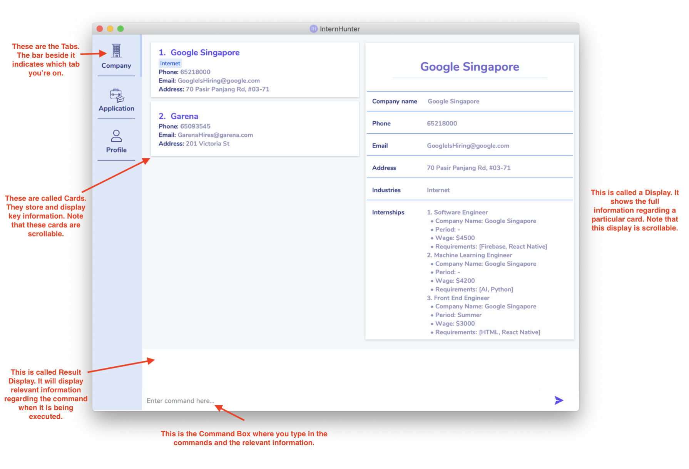

#### Understanding the technical terminologies

Word | What it means
-----|---------------
Commands | Words that determine the action of InternHunter.
Command word | The first word of every command.
Parameters | Information that is supplied by you.
Execute | Typing the information into the command box and pressing enter.
Item type for command | com, int, app, me.

#### Understanding the symbols

Symbol | What it means
-------|--------------
:information_source: | Important information to take note.
:bulb: | Extra tip.
:warning:| Warning.
`add` | Words that have a grey highlighted background are commands that can be keyed into the command box.
*italics* | Words in italics represent additional information.

#### Understanding the usage of the commands

:information_source: **Notes about the commands:** 

* The command word and the item type for the command are case-sensitive.

* Words in `UPPER_CASE` are the parameters to be supplied by you. 
  e.g. in `add com n/COMPANY_NAME p/PHONE_NUMBER e/EMAIL a/ADDRESS [t/INDUSTRY]...`, `COMPANY_NAME`, `PHONE_NUMBER`, `EMAIL`, `ADDRESS`, `INDUSTRY`,
  an example of how to fill up the parameters are `add com n/Google p/65218000 e/GoogleHire@gmail.com a/70 Pasir Panjang Rd, #03-71 t/Cloud Computing t/Artificial Industry`.

* Items in square brackets `[]` are optional. These parameters are optional because they are additional information 
  and you can key them in at a later date if you do not have the relevant information at hand. 
  e.g `add int INDEX j/JOB_TITLE [w/WAGE] [p/PERIOD] [r/REQUIREMENT]...` can be used as   `add int 1 j/Software Engineer` or
  `add int 3 j/Web Developer r/React w/3000 r/HTML5`.

* Items with `...`​ after them can be used multiple times including zero times. 
  e.g. `[r/REQUIREMENT]...` can be used as `r/Rust`, `r/React native r/JavaScript` etc.

* Parameters can be in any order. 
  e.g. if the command specifies `p/PERIOD w/WAGE`, `w/WAGE p/PERIOD` is also acceptable. Note that the command word and the item type should still come first.

* `INDEX` refers to the index of the item (Company, Internship, Application, or Profile Item) in its respective displayed list of
 items unless stated otherwise. All `INDEX`es are positive integers *(1, 2, 3, ...)*. 
 

--------------------------------------------------------------------------------------------------------------------

## **Features**

### **Company**

This represents a company, any company, but typically one you are interested in applying for an internship to.
You can record and maintain a company's name, phone number, email address, physical address, and its industry types.
You can then specify what internships the company is offering by using the [internship commands](#internship).

Note that all Company commands follow the following general 2-step process:

Step 1: Enter the command into the command box. An example command is given in the image below.

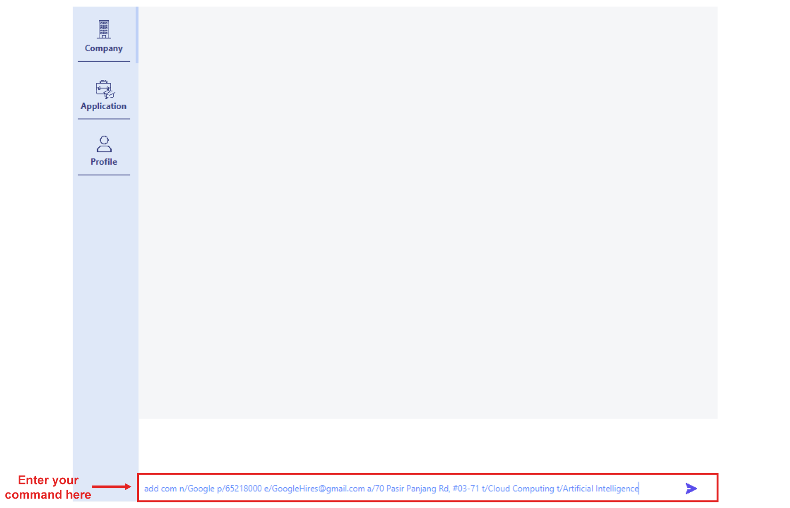

Step 2: Press 'Enter' on your keyboard to execute the command. Upon successful execution, you will see the results of 
your command reflected immediately in the app. An appropriate result message will also be displayed in the result 
display.

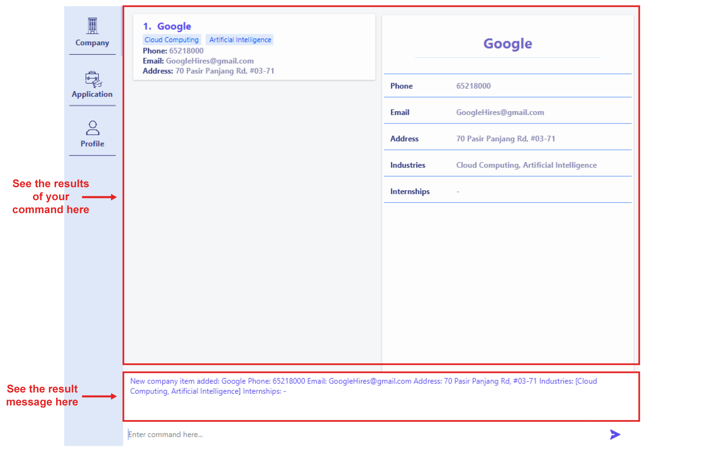

:information_source: **Note:** 
* You must create a company before you can create internships that the company offers.
* Company names are unique - you cannot add multiple companies with the same case-sensitive name (they will be 
 regarded as the same company and will not be allowed to exist in the app).

  :bulb: **Tip:** If you would like to store multiple different instances of the same company that differ by location
   (e.g. Google in Singapore and Google in San Francisco), since companies cannot share the same name, you can simply
    include the company's location in their name (e.g. `n/Google Singapore` and `n/Google San Francisco`)!
  

#### Adding a company: `add com`

Adds a company to your list of companies.

Format: `add com n/COMPANY_NAME p/PHONE_NUMBER e/EMAIL a/ADDRESS [t/INDUSTRY]...`

Examples:
- `add com n/Garena a/201 Victoria St e/GarenaHires@garena.com p/65093545` *(notice that the company's industry types
 need not be specified)*
- Executing `add com n/Google p/65218000 e/GoogleHires@gmail.com a/70 Pasir Panjang Rd, #03-71 t/Cloud Computing t/Artificial Intelligence`
on an empty company list will add the company as follows:  
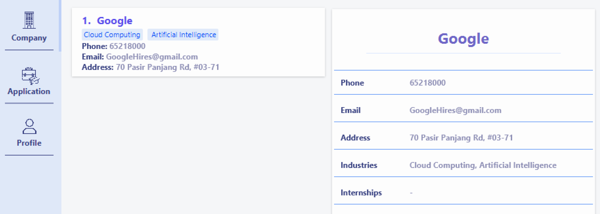

#### Deleting a company: `delete com`

Deletes a company from your list of companies. All internships and applications associated with this company will also be deleted.

Format: `delete com INDEX`

Example:
- `delete com 5`
- Executing `delete com 2` on the following list will delete the 2nd company as follows:  
  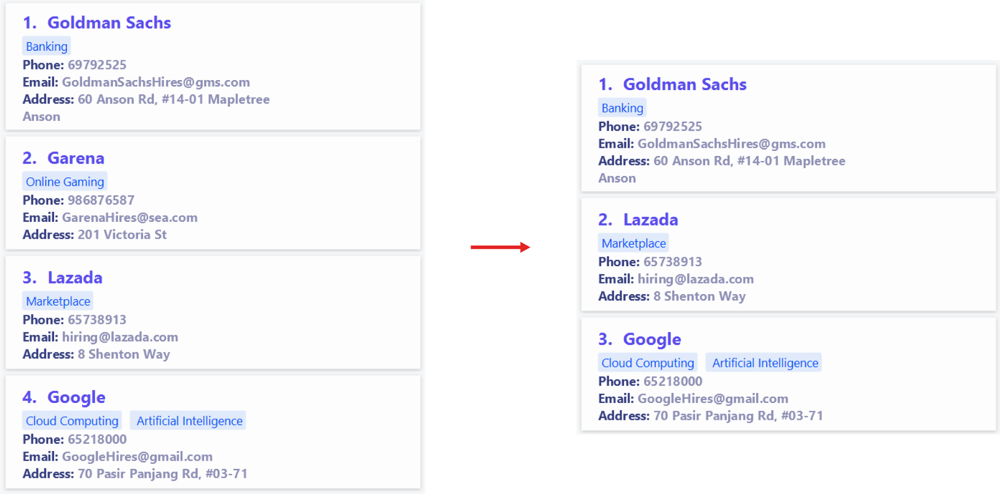

#### Editing a company: `edit com`

Edits a company in your list of companies.

Format: `edit com INDEX [n/COMPANY_NAME] [p/PHONE_NUMBER] [e/EMAIL] [a/ADDRESS] [t/INDUSTRY]...`
- At least one of the optional fields must be provided.
- Existing values will be updated to the input values.
- When editing industry types, the existing industry types get removed i.e. industry types do not accumulate.
- You can remove all of a company’s industry types by simply typing `t/` without specifying anything after it.

Examples:
- `edit com 2 p/61234567`
- For the following example, executing `edit com 1 n/Google Singapore e/GoogleIsHiring@google.com t/Internet` will
 edit company 1 as follows:  
   
 
 *(Notice that by editing industry types, the existing industry types get replaced i.e. industry types do not
  accumulate)*

#### Viewing a company: `view com`

Selects a company in your list of companies to show in detail on the right panel.

Format: `view com INDEX`

Examples:
- `view com 3`
- Suppose you are currently viewing the first company and you want to view the second company. Executing `view com 2` 
will update the right panel to display the second company:  
   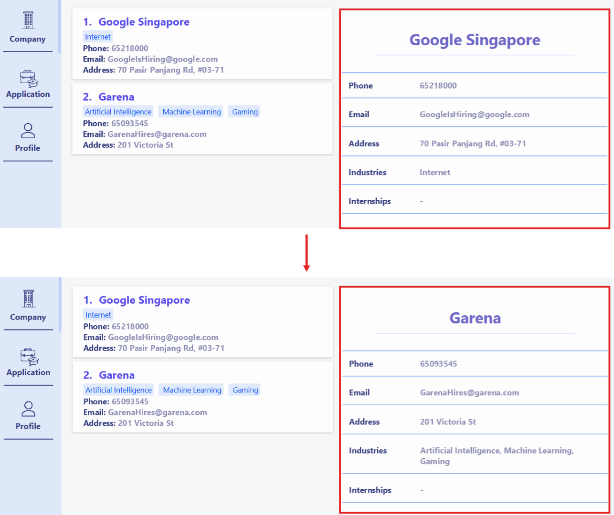  

#### Finding companies: `find com`

Finds all companies in your list of companies whose names contain any of the given keywords.

Format: `find com KEYWORD [ANOTHER_KEYWORD]...`
- Only the company name will be searched for.
- The search is case-insensitive. e.g. `google` will match `Google`.
- Companies with names matching at least one keyword will be returned. e.g. `Google Facebook` will return companies
 whose names contain the word `Google` or `Facebook`.
- The order of the keywords does not matter. e.g. `Google Facebook` and `Facebook Google` will return the same results.
- Only full words will be matched. e.g. `Googl` will not match `Google`.

:information_source: **Note:** 
Upon successful execution of this command, your company list will be updated to only show matching results. All 
subsequent delete, edit and view company commands will use indexing based on this updated list. Switching tabs will 
not return the list to its full state. If you wish to return to seeing all the companies in your list, 
execute [`list com`](#listing-all-companies-list-com).

Examples:
- `find com Amazon`
- Suppose you have this list of companies. Executing `find com google` will update the list to show matching
 companies:  
     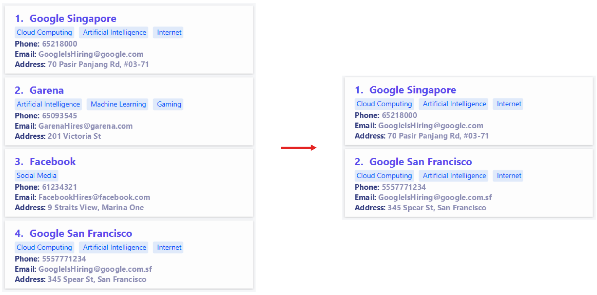  
     
     And executing `find com google facebook` will return the following:  
       

#### Listing all companies: `list com`

Lists out **all** companies in your list of companies. After using the `find com` command, you would have likely
narrowed your list of companies down to a few search results. Use the `list com` command to revert to seeing all the
companies in your list.

Format: `list com`

Example:
- If you have 4 companies in total in your company list, and your list is currently only showing 2 companies after
 having executed a `find com` command, to view all the companies in your list, execute `list com`:  
 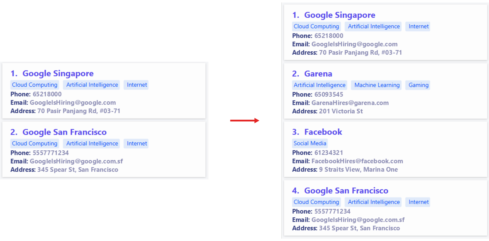

### **Internship**

#### Adding an internship to a company: `add int`

Adds an internship to a company.

Format: `add int INDEX j/JOB_TITLE [w/WAGE] [p/PERIOD] [r/REQUIREMENT]...`
- `PERIOD` can refer to any word (e.g. `3 months`, `Summer break`, `Jun - Aug 2021`).
- `WAGE` must be a positive integer (without leading zeroes or + symbol).

Examples:
- `add int 3 j/Web Developer w/3000 p/30 May to 30 Aug r/React r/HTML5`
- `add int 1 j/Machine Learning Engineer w/4700` 

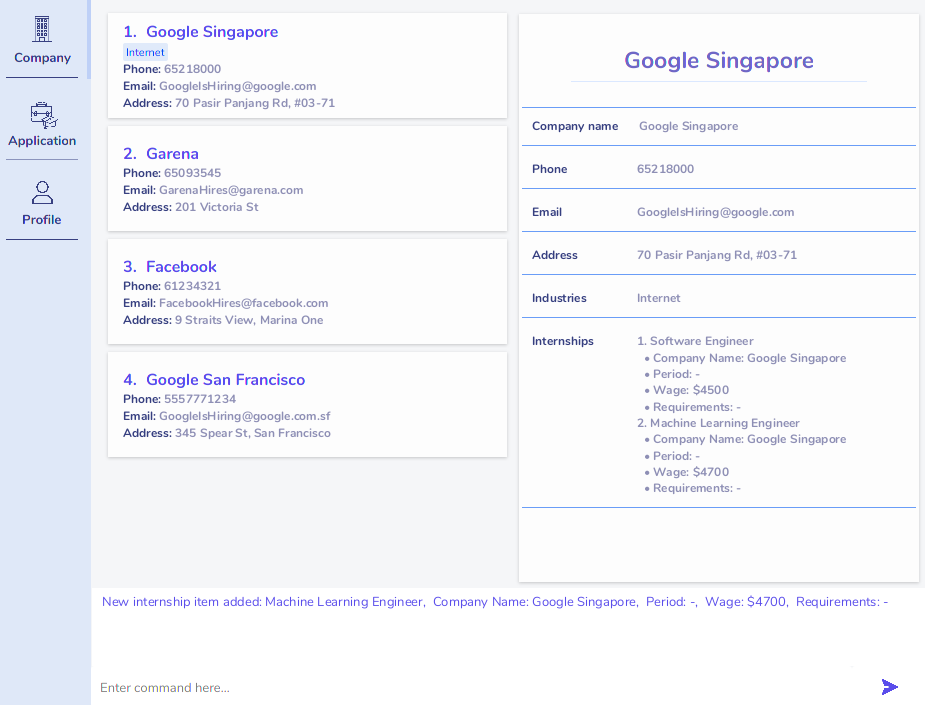

#### Deleting an internship from a company: `delete int`

Deletes an internship from a company. The application (if any) made with this internship will also be deleted.
 
Format: `delete int INDEX i/INDEX` 
- `INDEX` refers to the index of the company in the company list, and `i/INDEX` refers to the index of the
internship in the company’s list of internships.

Example:
- `delete int 3 i/2`

#### Modifying an internship's details: `edit int`

Edits an internship from a company. The application (if any) made with this internship will also be edited.

Format:  `edit int INDEX i/INDEX [j/JOB_TITLE] [w/WAGE] [p/PERIOD] [r/REQUIREMENT]...`
- `INDEX` refers to the index of the company in the company list, and `i/INDEX` refers to the index of the
internship in the company’s list of internships.
* At least one of the optional fields must be provided.
* Existing values will be updated to the input values.
* When editing `REQUIREMENTS`, all existing requirements get replaced by the new specified requirements.
* You can remove all `REQUIREMENTS` by adding r/ without anything after it.

Examples:
- `edit int 3 i/1 j/Frontend Developer`
- Executing `edit int 1 i/2 w/4800 r/Java r/Python`:

If an application is already created for the internship, it will also be edited as shown below:

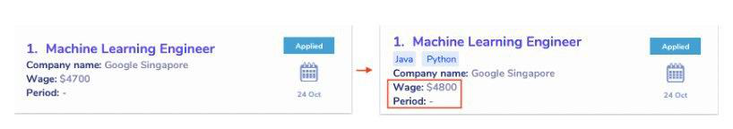

### **Application**

Now that you have learnt how to manage your companies and internships, the next burning question you probably have is 
how to use InternHunter to apply, track and manage your internship applications. Read on through this section to find 
out how.

#### All about applications

Each application comes with a `STATUS` and `STATUS_DATE` field which indicates the
date that the `STATUS` was set/updated.

Valid `STATUS` specifiers:
- `Applied`
- `Interview`
- `Waiting`
- `Rejected`
- `Offered`
- `Accepted`

  :information_source: **Note:** Status added is case-insensitive
  

Valid `STATUS_DATE` formats:

- d-M-yy HHmm
    - e.g. `23-12-20 2230`
- d-M-yy
    - e.g. `23-12-20`
    - Time will be taken as 2359

  :information_source: **Note:** Date added must be in the future and all dates added will be from the current year to
  the year 2099
  

Here is how the application tab looks like: 

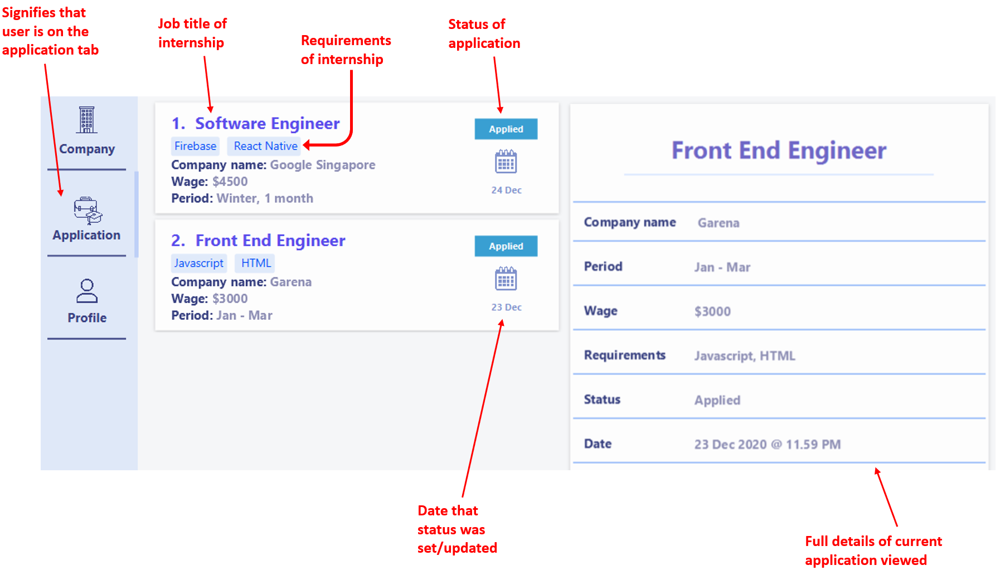

#### Command execution

All application commands follow the following general 2-step process:

Step 1: Enter the command into the command box. An example command is given in the image below.

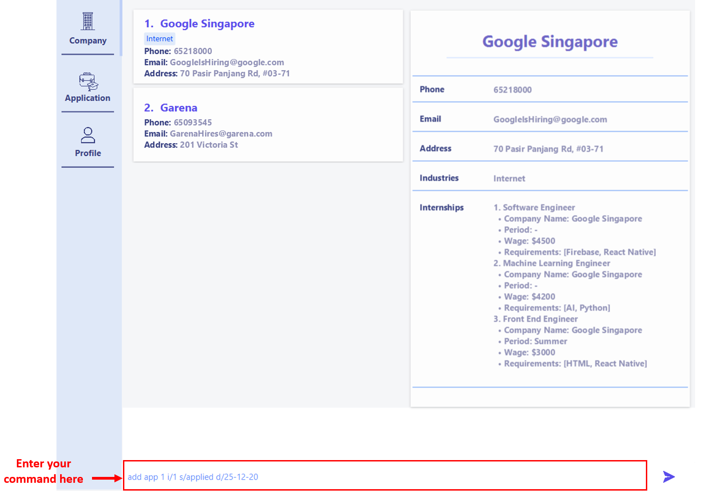

Step 2: Press 'Enter' on your keyboard to execute the command. Upon successful execution, you will see the results of 
your command reflected immediately in the app. An appropriate result message will also be displayed in the result 
display.

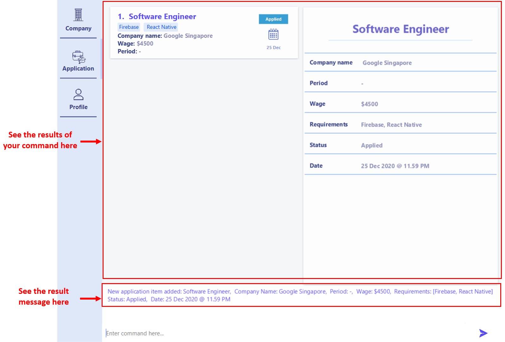

#### Applying for an internship: `add app`

Selects an internship from a company and adds it to your list of applications. If unspecified, the application’s
`STATUS` will be `Applied`, and it’s `STATUS_DATE` will be set as today’s date and time to be 2359.

Format: `add app INDEX i/INDEX [s/STATUS] [d/STATUS_DATE]`
- Where `INDEX` refers to the index of the company in the company list, and `i/INDEX` refers to the index of the
internship in the company’s internship list.

Example:
- Suppose you are interested in applying for the Software Engineer internship in Google Singapore:

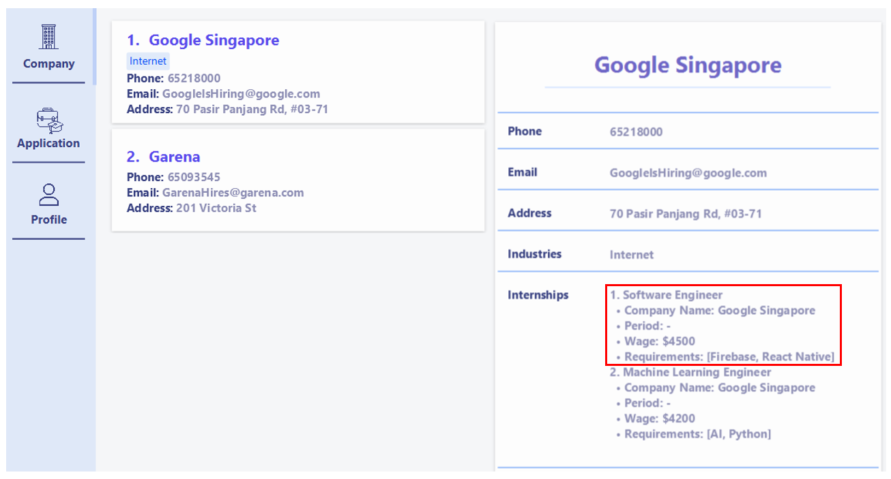

Executing `add app 1 i/1 d/24-12-20` will apply for the internship as follows.
Note that you will be automatically switched to the application tab to view the application made:

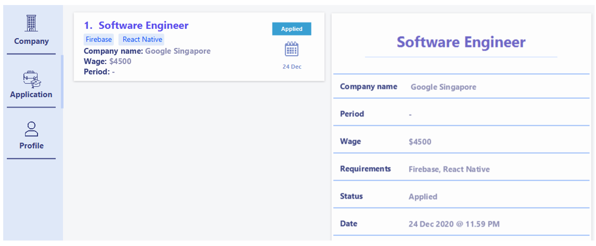

#### Deleting an application: `delete app`

Deletes an application from your list of applications.
 
Format: `delete app INDEX` 

Example:
- Suppose you have these 2 applications in your application list and you want to delete the 2nd application in the list.
Executing `delete app 2` will delete the 2nd application and update the list to show the remaining applications:

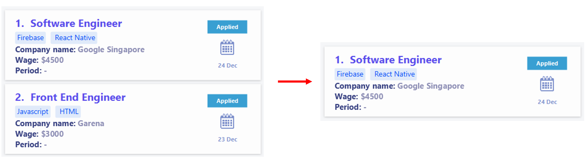

#### Updating an application: `edit app`

Updates an application in your list of applications.

Format: `edit app INDEX [s/STATUS] [d/STATUS_DATE]`
- At least one of the optional fields must be provided.

Example:
- Suppose Google Singapore has replied to your application for the Software Engineer internship and has called you up 
for an interview on the 28 Dec 2020, 2pm. Executing `edit app 1 s/interview d/28-12-20 1400` will update this 
application as follows:

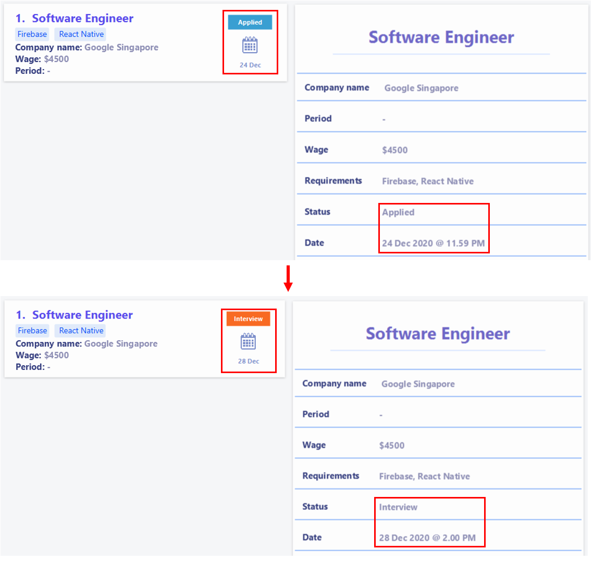

#### Viewing an application's details in full: `view app`

Selects an application in the list of applications to show in detail on the right panel.
 
Format: `view app INDEX`

Example:
- Suppose you are currently viewing the first application and you want to view the second application. 
Executing `view app 2` will update the right panel to display the second application:

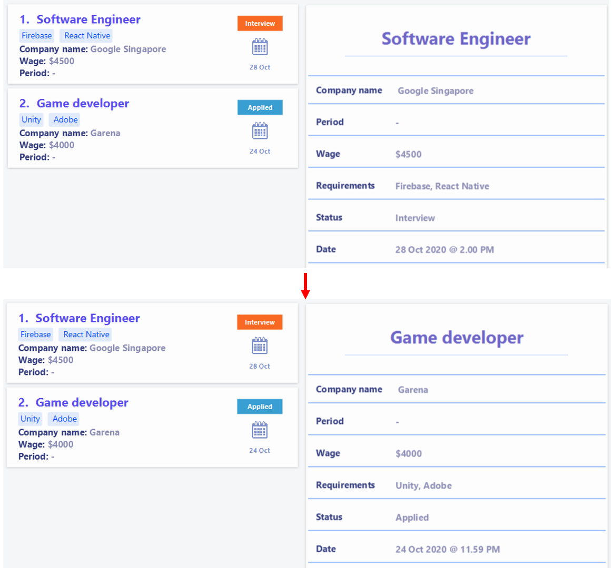

#### Finding applications: `find app`

Finds all applications in your list of applications whose job titles contain any of the given keywords.

Format: `find app KEYWORD [ANOTHER_KEYWORD]...`
- Only the application job title will be searched for.
- The search is case-insensitive. e.g. `engineer` will match `Engineer`.
- Applications with job titles matching at least one keyword will be returned. e.g. `Software Engineer` will return
applications whose job titles contain the word `Software` or `Engineer`.
- The order of the keywords does not matter. e.g. `Software Engineer` and `Engineer Software` will return the same results.
- Only full words will be matched. e.g. `Engineer` will not match `Engine`.

:information_source: **Note:** 
Upon successful execution of this command, your application list will be updated to only show matching results. All 
subsequent delete, edit and view application commands will use indexing based on this updated list. Switching tabs will 
not return the list to its full state. If you wish to return to seeing all the applications in your list, 
execute [`list app`](#listing-all-applications-list-app).

Example:
- Suppose you have this list of applications. Executing `find app engineer` will update the list to show matching
applications:

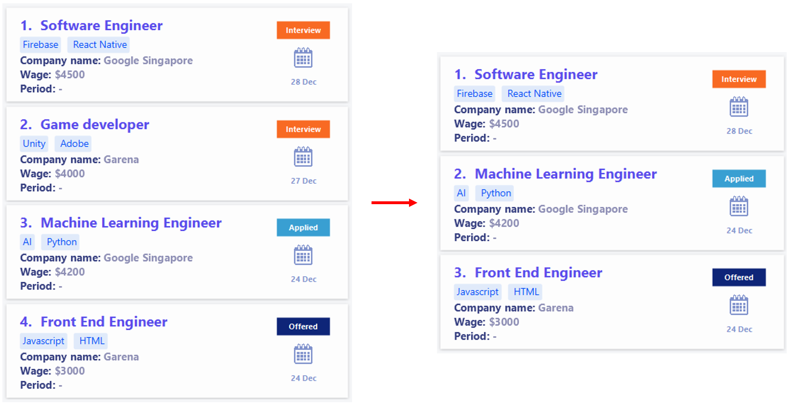

#### Listing all applications: `list app`

Lists out **all** applications in your list of applications. After using the `find app` command, you would have likely
narrowed your list of applications down to a few search results. Use the `list app` command to revert to seeing
all the applications in your list.

Format: `list app`

Example:
- Following the result of `find app engineer` on the application list from the example shown in the
[find application command](#finding-applications-find-app), execution of `list app` will update the list to show 
**all** 4 applications in your list of applications:

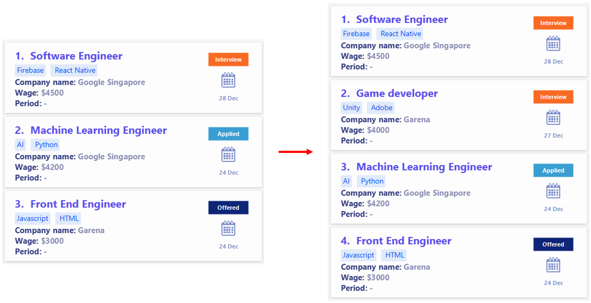

### **Profile**

The profile feature offers you the ability to keep track and maintain your personal portfolio. It stores
profile items which are entities that describe an achievement, a past experience or a skill you have acquired.
It assists you in crafting a tailored resume for your internship applications by allowing you to find items in your
profile which are relevant to the job description through the [find feature](#finding-items-in-profile-find-me).

Each profile item belongs to 1 of 3 categories.

Valid `CATEGORY` specifiers:
- `achievement`
- `experience`
- `skill`

Each category is represented by the following icons in the UI:

| CATEGORY   | ICON 
|------------|------------------
|`achievement`| 
|`experience` | 
|`skill`      | 

Each profile item also contains a `TITLE` that describes the item, and you can optionally 
add additional `DESCRIPTOR`s to further describe the item in point form.

Here is how the profile tab looks like: 

#### Command execution

Note that all Profile commands follow the following general 2-step process:

Step 1: Enter the command into the command box. An example command is given in the image below.

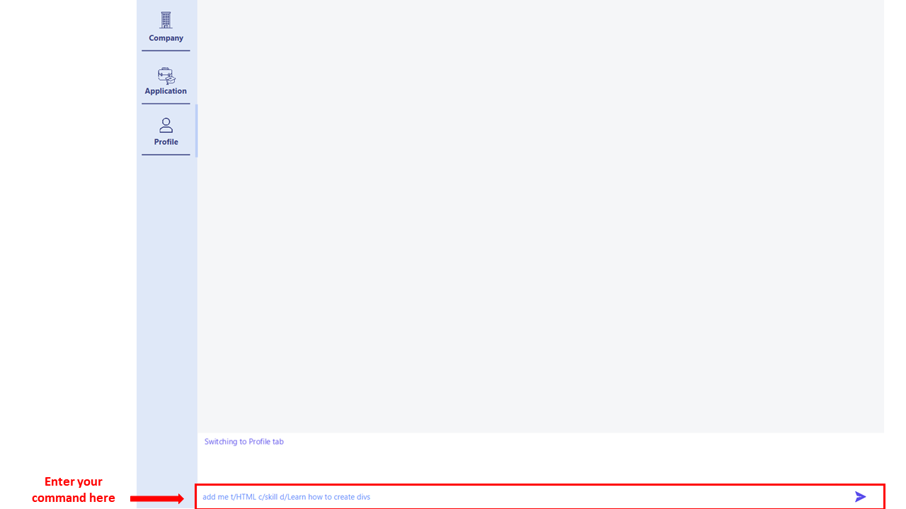

Step 2: Press 'Enter' on your keyboard to execute the command. Upon successful execution, you will see the results of 
your command reflected immediately in the app. An appropriate result message will also be displayed in the result 
display.

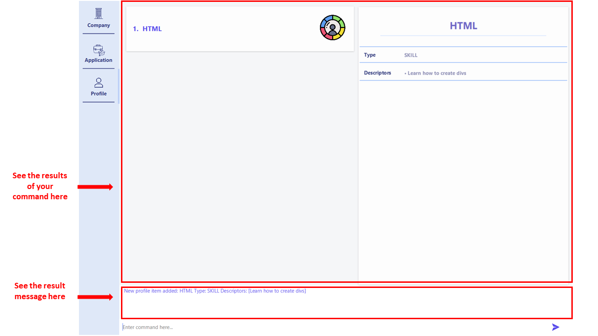

  :bulb: **Tip:** If you want to store multiple experiences or achievements of the same name, for example taking part
   in the Open Hack Hackathon in 2 different years, since profile items cannot have identical titles of the same
    category, you can simply include when the event occurred in the title. (e.g. `t/Participated in Open Hack 2020
    ` and `t/Participated in Open Hack 2019`)!
     

#### Adding an item to your profile: `add me`

Adds a profile item to your profile.

Format: `add me t/TITLE c/CATEGORY [d/DESCRIPTOR]...`

Examples:
* `add me t/HTML c/skill d/Learn how to create divs`
* `add me t/special recognition in Hack n Roll c/achievement`
* For example, you have just completed an internship at Govtech. Executing `add me t/Internship at Govtech 
 c/experience d/Implemented automate testing using TravisCI d/Implemented dashboard to track code coverage` on an empty 
 profile will add the profile item as follows:  
 

#### Deleting an item from your profile: `delete me`

Deletes experience, skills or achievements from your profile.

Format: `delete me INDEX`

Example:
* `delete me 2`
* Executing `delete me 2` on the following list will delete the 2nd profile item as follows:  

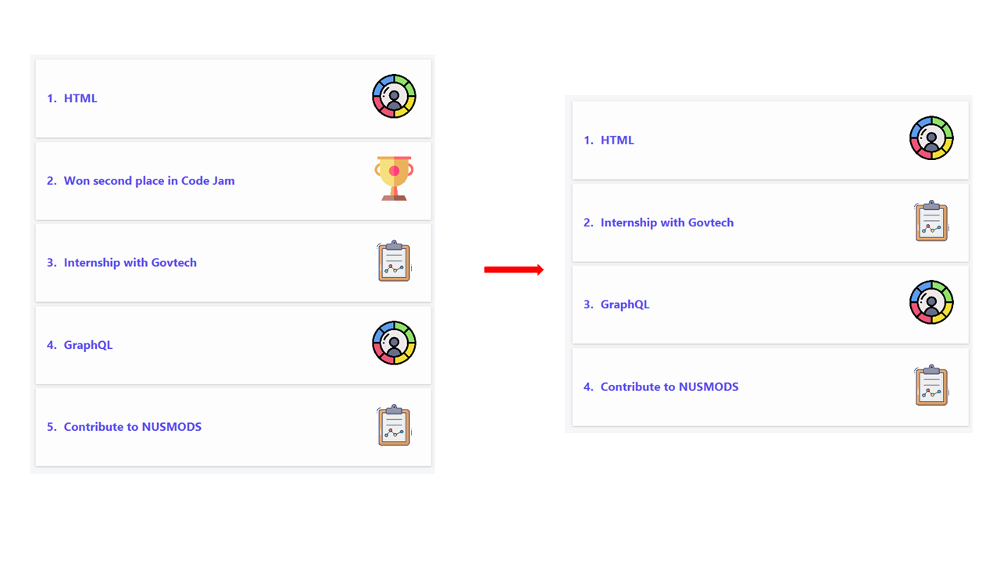

#### Updating profile item details: `edit me`

Edit the experience, skills or achievements of your profile.

Format: `edit me INDEX [t/TITLE] [c/CATEGORY] [d/DESCRIPTORS]`
* At least one of the optional fields must be provided.
* Existing values will be updated to the input values.
* When editing `DESCRIPTORS`, all existing descriptors get replaced by the new specified descriptors.
* You can remove all `DESCRIPTORS` by adding `d/` without anything after it.

Examples:
* `edit me 2 t/CSS c/skill d/learnt how to use flexbox`
* For example if you want to update the title and descriptor of the first item in your profile.
* Executing `edit me 1 t/Internship at Google d/Build a dashboard` will edit the profile item as follows: 
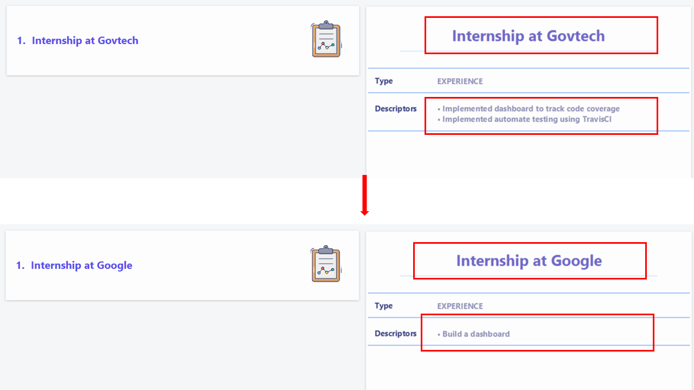 
 *(Note that the existing descriptors get replaced)*
 
#### Viewing a profile item's details in full: `view me`

Selects an item in the profile to show in detail on the right panel.

Format: `view me INDEX`

Example:
* `view me 3`
* For example if you have the following profile items and you want to view the third item in your user profile. Executing `view me 3` will show the following: 

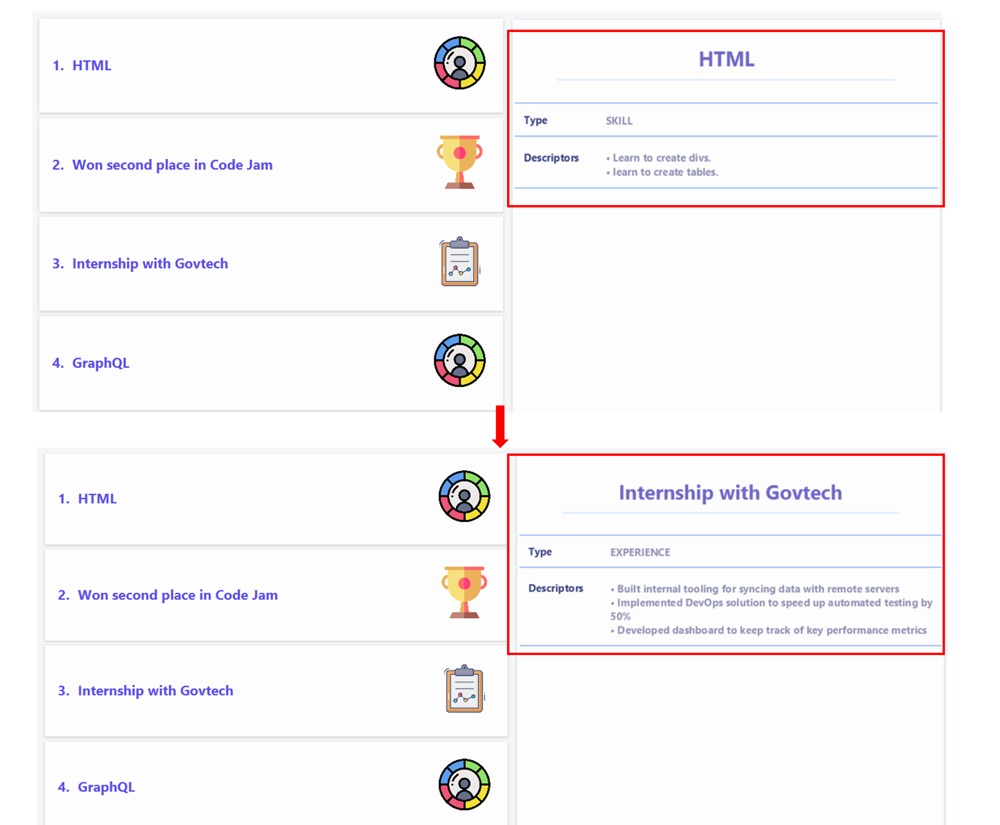 
*(As you can see the details of the third item can be seen in the right panel)*

#### Finding items in profile: `find me`

Finds all items in your profile whose titles contain any of the specified keywords.

Format: `find me KEYWORD [ANOTHER_KEYWORD]...`
- Only the profile item's title will be searched for.
- The search is case-insensitive. e.g. `HTML` will match and return items with `html` in its title.
- Profile items with titles matching at least one keyword will be returned. e.g. `Hackathon Internship` will return
 a list of profile items whose titles contain the word `Hackathon` or `Internship`.
- The ordering of the keywords does not affect the outcome of the query. e.g. `Hackathon Internship` and `Internship
 Hackathon` will return the same results.
- Only full words will be matched. e.g. `Intern` will not match `Internship`.

:information_source: **Note:** 
Upon successful execution of this command, your profile list will be updated to only show matching results. All 
subsequent delete, edit and view application commands will use indexing based on this updated list. Switching tabs will 
not return the list to its full state. If you wish to return to seeing all the profile items in your list, 
execute [`list me`](#listing-all-items-in-profile-list-me).

Examples:
- For the following example, if the profile contains the following items. Executing `find me internship` will return
 the following:  
       
     And executing `find me internship google` will return the following:  
     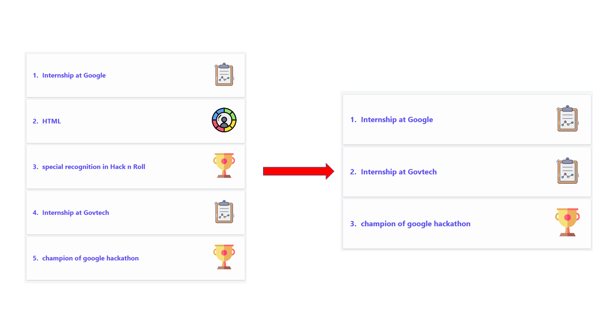  
     *(As you can see, the search results match at least one of the keywords specified regardless of its casing)*

#### Listing all items in profile: `list me`

Lists out all items in your profile. After using the `find me` command, you would have likely filtered 
your list of profile items down to a few search results. You can then use the `list me` command to revert to seeing 
all the items in your profile.

Format: `list me`

Example:
- If you have 5 items total in profile list, and your list is currently only showing 2 profile items after
 having executed a `find me` command, to view all the items in your profile list, execute `list me`:  
 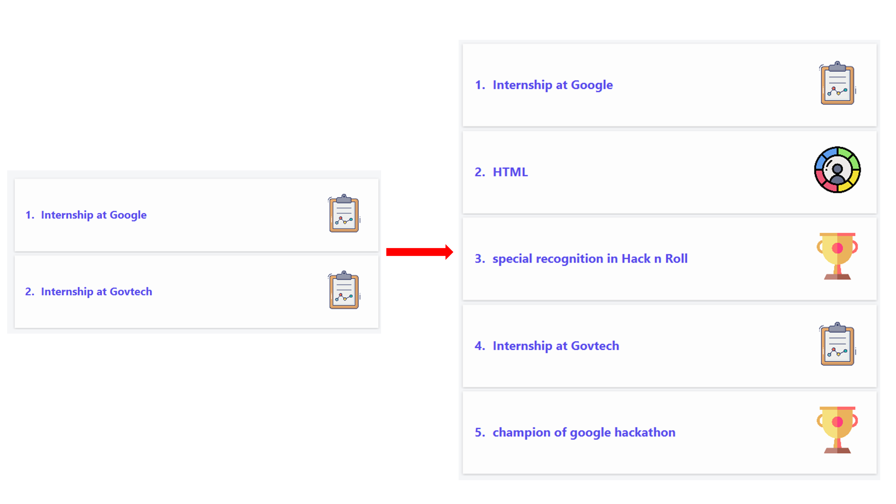

### **Finding the most suitable internships**

#### Generating matching internships: `match`

Generates a list of internships that have requirements that matches your current set of skills.

Format: `match`
- Only the `Requirement` field in the internships will be searched for.
- Only profile items with `Skill` category will be used for matching.
- An Internship with at least one `Requirement` matching any one `Skill` in the profile list will be
considered as a successful match. e.g. Say you have a profile item which is of `Skill` category and titled `Python`, any
internship that has a `Requirement` of `Python` will be successfully matched.
- An Internship with no requirements will never be matched.
- Matched internships can have `Requirements` that do not match with the profile `Skills`, since a match is found when
an internship has **at least one and not all** `Requirements` that matches with the profile `Skills`.
- Matching done is case-insensitive. e.g. `Python` will match `python`.
- Only the full phrase will be matched. e.g. `Machine` will not match `Machine Learning`.

Example:

1. Say you currently have these 2 list of internships from Google Singapore and Garena:

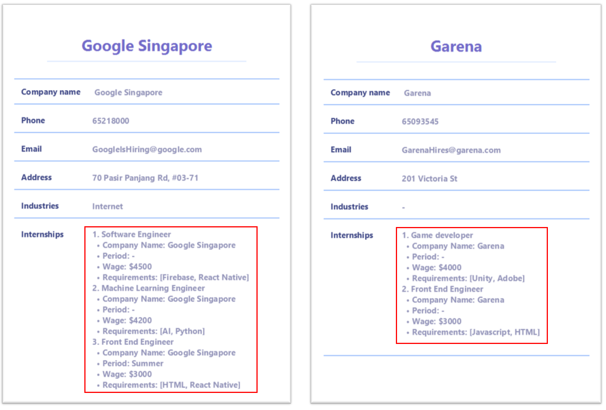

2\. And this is your current profile item list. Note that only the 2 profile items of `Skill` type will be used for
matching with the internships.

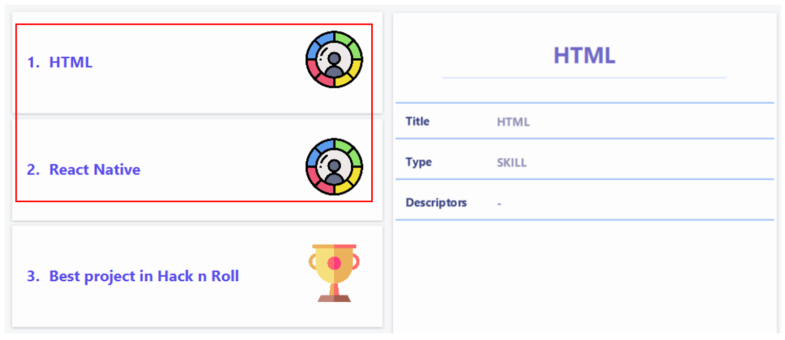

3\. All that's left to do is to type the `match` word in the command box.

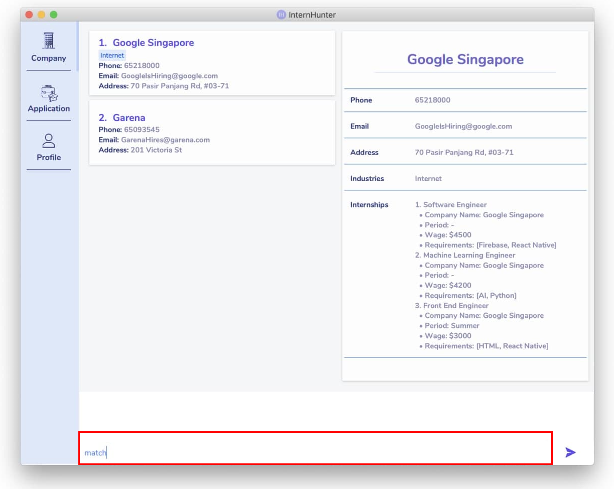

  :information_source: **Note:** You can be on any tab to execute this command.

4\. A pop-up window showing the list of matching internships will be displayed!

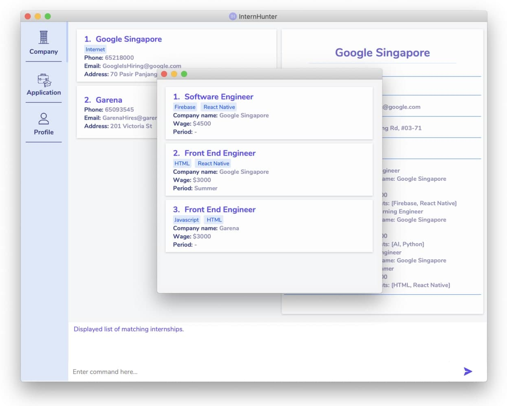

  :bulb: **Tip:** You can press Esc key to close the popup window!
  

### **General**

#### Switching Tabs: `switch`

Switches between tabs.

Format: `switch TYPE`

There are three `TYPE`s:
* `com`
* `app`
* `me`

`com` refers to Company tab, `app` refers to Application tab, `me` refers to Profile tab.

Example:

1. Suppose you want to switch tabs to the application tab. Executing `switch app` will switch the tabs to application tab.

2\. Note that the tabs have been changed as well as the cards and display.

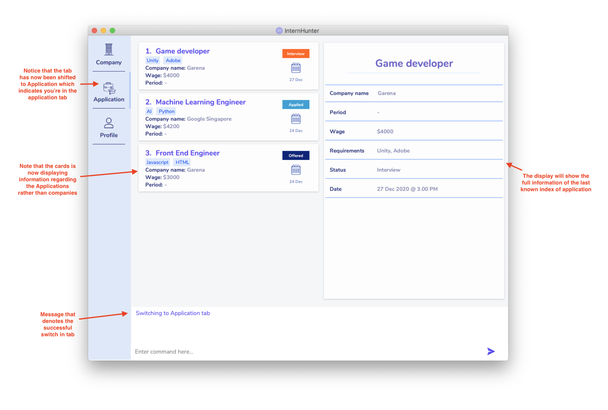

#### Clearing all entries: `clear`

Clears all entries from InternHunter.

Format: `clear`

  :warning: **Warning:** `clear` will clear all data, i.e. all companies, internships, applications and profile items.
  

Example:

1. Suppose you want to clear all your data in InternHunter. Executing `clear` will clear all the data.

2\. Note that all the data has been wiped as seen in the Ui.

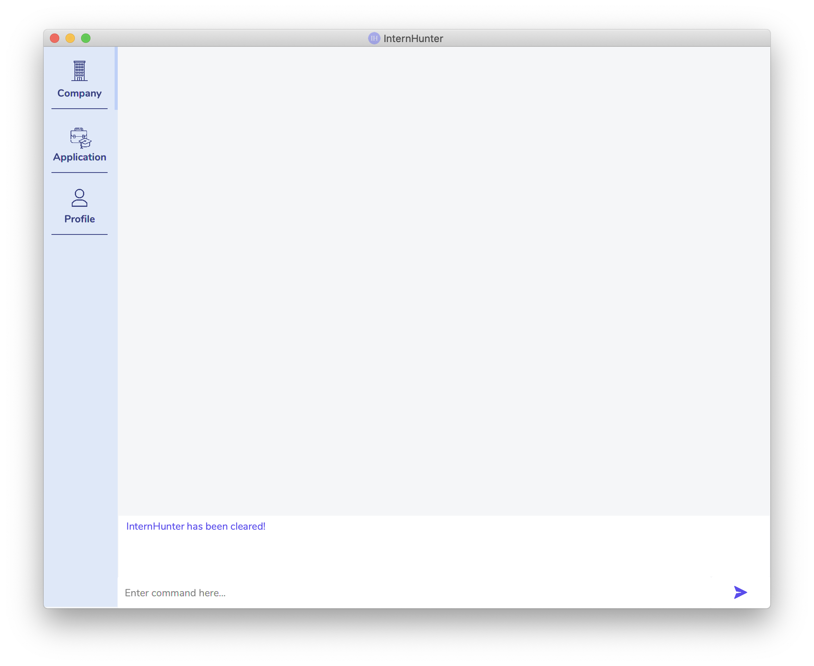

#### Viewing help: `help`

Displays a link to the InternHunter user guide.

Format: `help`

  :bulb: **Tip:** You can press Esc key to close the help window!
  

 

Example:

1. Suppose you can't remember the commands. Fret not, executing `help` will generate a new window containing the link to the user guide!

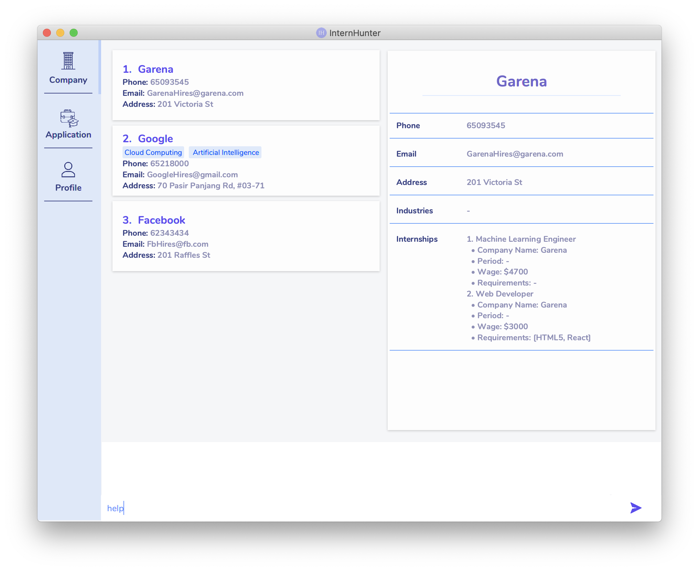

2\. Copy the link and access our user guide for more information.

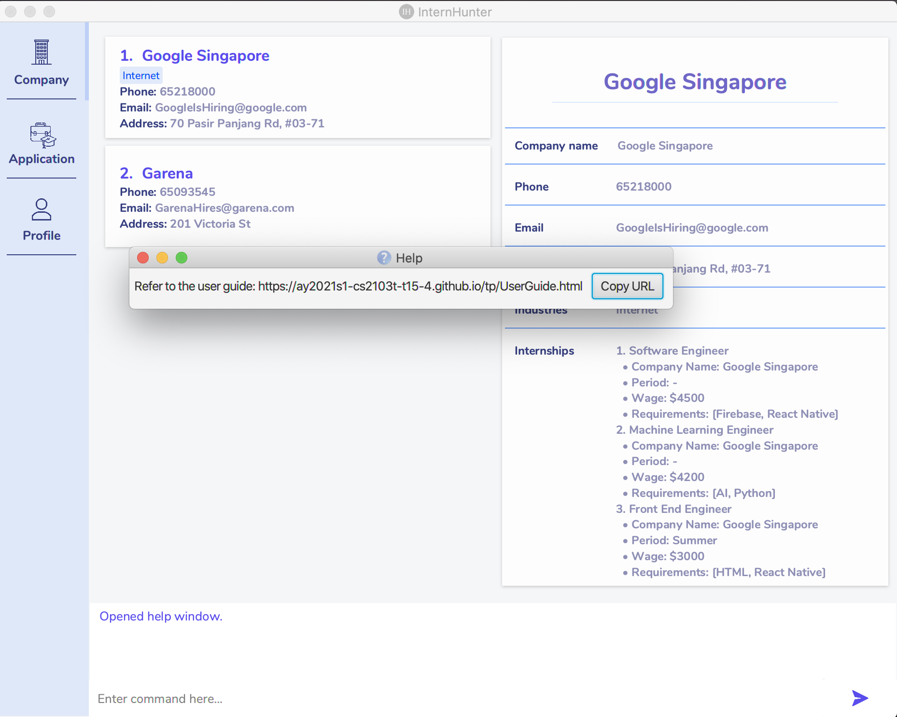

#### Exiting the program: `exit`

Shows an exit confirmation dialog.

Format: `exit`

  
  :bulb: <strong>Tip:</strong>  
  For <strong>MacOS</strong> users, you can navigate the options using <strong>tab</strong> on your keyboard and pressing <strong>spacebar</strong> to confirm your choice.  
  For <strong>Windows</strong> and Linux users, similarly, you can use <strong>tab</strong> to navigate. However, instead of using <strong>spacebar</strong>, you should use <strong>enter</strong> instead.  
  

 

Example:

1. Suppose you want to exit InternHunter without clicking the cross button, executing `exit` will generate a new window to confirm your request of exitting.

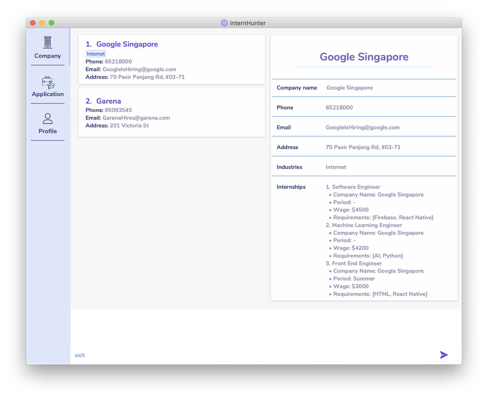

2\. At this stage, you have the option to confirm the exit or continue to stay in InternHunter.

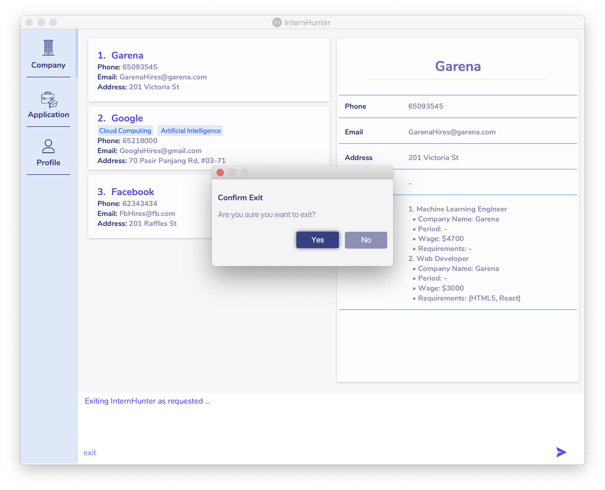

--------------------------------------------------------------------------------------------------------------------

## **FAQ**

**Where does InternHunter store its data?**  
By default, InternHunter will save all the information into a folder called "data" in the app's home directory (i.e. the 
folder in which you placed the app). The data is stored in 3 separate JSON files: `applicationitemlist.json`, 
`companyitemlist.json` and `profileitemlist.json`.

**How do I transfer my data to another computer I would like to run InternHunter on?**  
Simply copy the data folder from the app's home directory and transfer it into the directory of the other computer in 
which you've placed InternHunter. InternHunter will then be able to reuse this data.

**Do I have to save my data manually?**  
There isn't a need for you to manually save your data. InternHunter will automatically save your data while you are 
running the app.

**What happens if I accidentally clear all my data using `clear`?**  
InternHunter currently does not provide an undo command so it is not possible to retrieve any deleted data. 
Make sure to run `clear` only if you are completely certain that you would like to delete all your data!

**When does InternHunter use sample data?**  
InternHunter uses sample data when the user first launches the app. More specifically, 
when **all** of applicationitemlist.json, companyitemlist.json, and profileitemlist.json are missing.

**Why is my data missing?**  
Make sure your json files are in the correct folder and format. If not, InternHunter will use empty lists.

--------------------------------------------------------------------------------------------------------------------

## **Command summary**

### Navigating InternHunter

Action     | Format
-----------|------------------
**Switch** | `switch TYPE`

### Company

Action     | Format
-----------|------------------
**Add**    | `add com n/COMPANY_NAME p/PHONE_NUMBER e/EMAIL a/ADDRESS [t/INDUSTRY]...`
**Delete** | `delete com INDEX`
**Edit**   | `edit com INDEX [n/COMPANY_NAME] [p/PHONE_NUMBER] [e/EMAIL] [a/ADDRESS] [t/INDUSTRY]...`
**View**   | `view com INDEX`
**Find**   | `find com KEYWORD [ANOTHER_KEYWORD]...`
**List**   | `list com`

### Internship

Action     | Format
-----------|------------------
**Add**    | `add int INDEX j/JOB_TITLE [w/WAGE] [p/PERIOD] [r/REQUIREMENT]...`
**Delete** | `delete int INDEX i/INDEX`
**Edit**   | `edit int INDEX i/INDEX [j/JOB_TITLE] [p/PERIOD] [w/WAGE] [r/REQUIREMENT]...`

### Application

Action     | Format
-----------|------------------
**Add**    | `add app INDEX i/INDEX [s/STATUS] [d/STATUS_DATE]`
**Delete** | `delete app INDEX`
**Edit**   | `edit app INDEX [s/STATUS] [d/STATUS_DATE]`
**View**   | `view app INDEX`
**Find**   | `find app KEYWORD [ANOTHER_KEYWORD]...`
**List**   | `list app`

### Profile

Action     | Format
-----------|------------------
**Add**    | `add me t/TITLE c/CATEGORY [d/DESCRIPTOR]...`
**Delete** | `delete me INDEX`
**Edit**   | `edit me INDEX [t/TITLE] [c/CATEGORY] [d/DESCRIPTOR]...`
**View**   | `view me INDEX`
**Find**   | `find me KEYWORD [ANOTHER_KEYWORD]...`
**List**   | `list me`

### Finding the most suitable internships

Action     | Format
-----------|------------------
**Match**  | `match`

### General

Action     | Format
-----------|------------------
**Clear**  | `clear`
**Help**   | `help`
**Exit**   | `exit`
