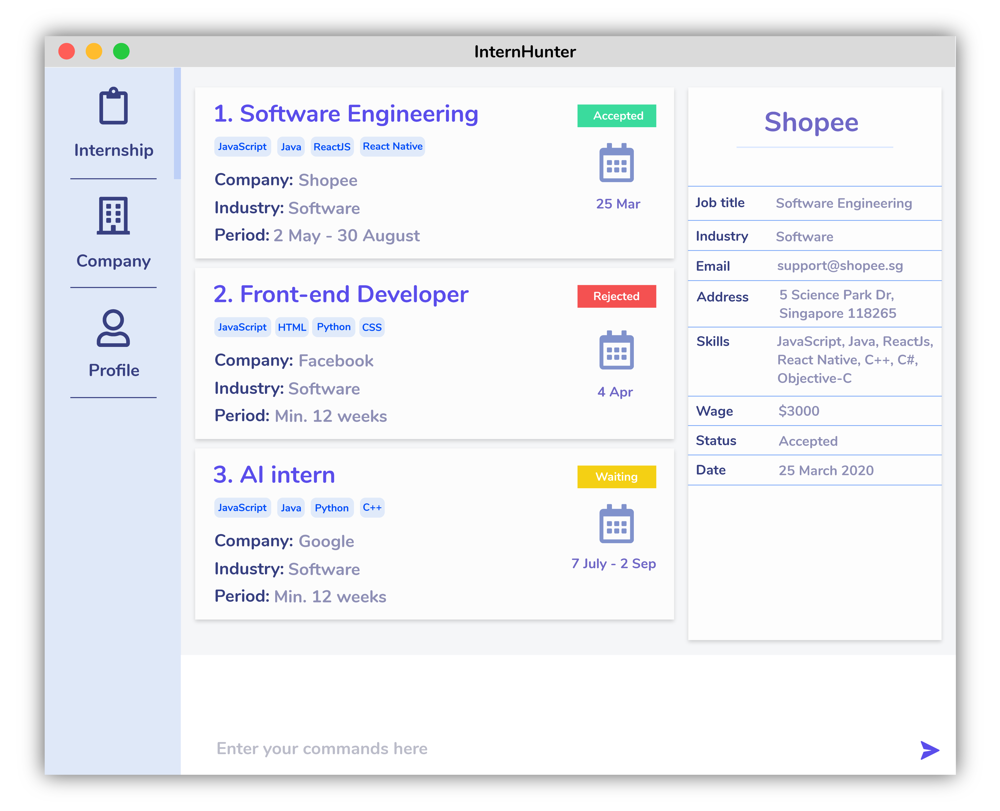
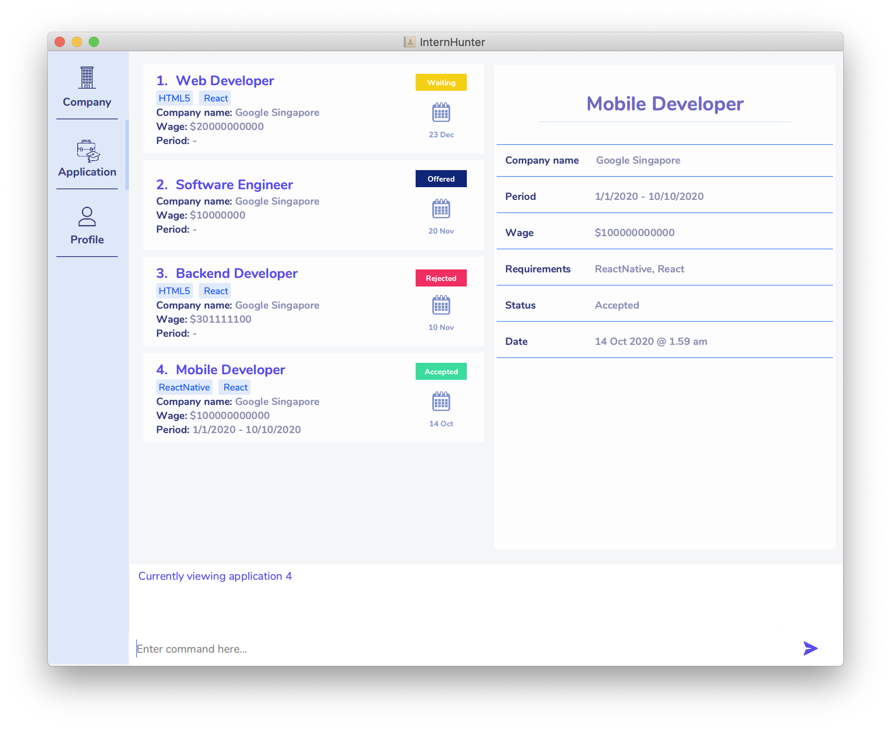
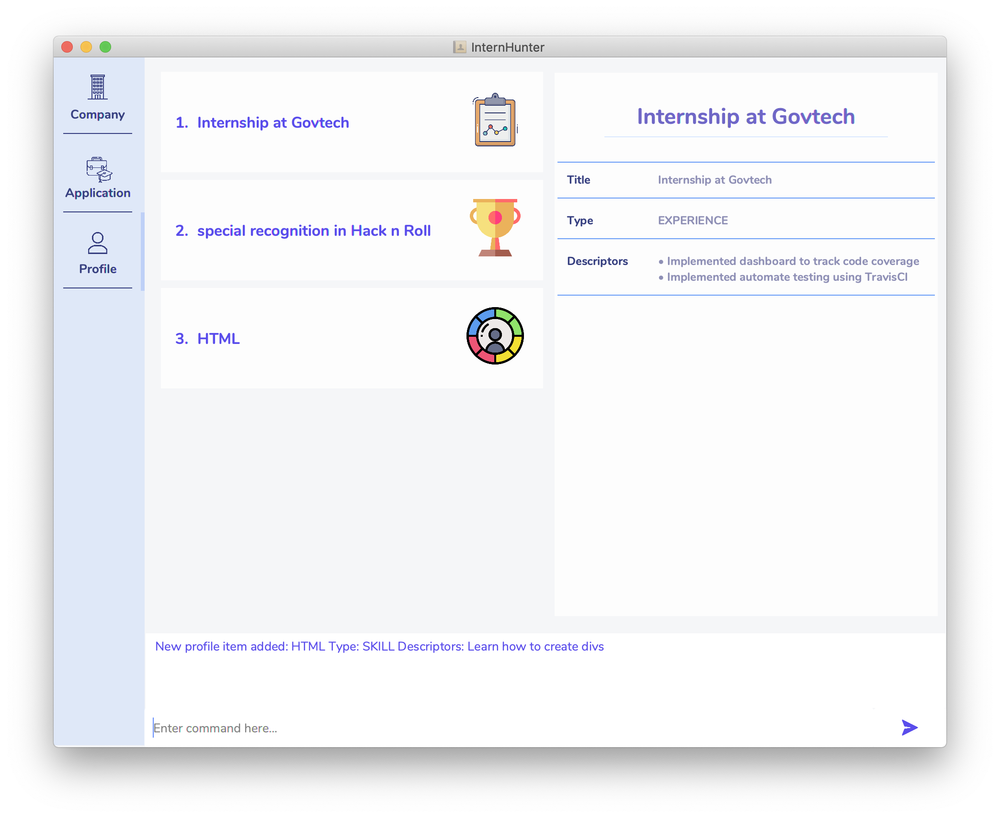

<h1 align="center">InternHunter</h1>

    
    

  
  

Welcome to **InternHunter**, a CLI-centric desktop application which aids university students in applying for tech
internships. It lets users manage their own customisable collection of companies, internships, internship applications
and their own user profile, so that they can keep track of internships that they are interested in.

## Site Map
- [User Guide](https://github.com/AY2021S1-CS2103T-T15-4/tp/blob/master/docs/UserGuide.md)
- [Developer Guide](https://github.com/AY2021S1-CS2103T-T15-4/tp/blob/master/docs/DeveloperGuide.md)
- [About Us](https://github.com/AY2021S1-CS2103T-T15-4/tp/blob/master/docs/AboutUs.md)
 
## Acknowledgements
- This project was extended from AddressBook-Level3 project created by [SE-EDU initiative](https://se-education.org).
- Libraries Used: [JavaFX](https://github.com/openjdk/jfx), [Jackson](https://github.com/FasterXML/jackson),
[JUnit5](https://github.com/junit-team/junit5)

## Licence : [MIT](https://github.com/AY2021S1-CS2103T-T15-4/tp/blob/master/LICENSE)
